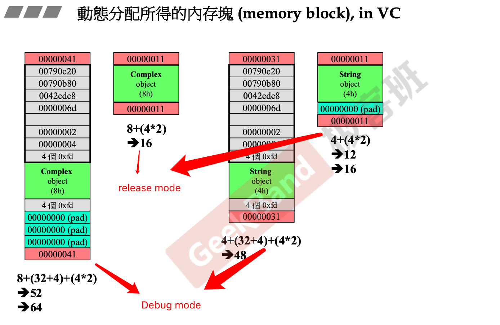
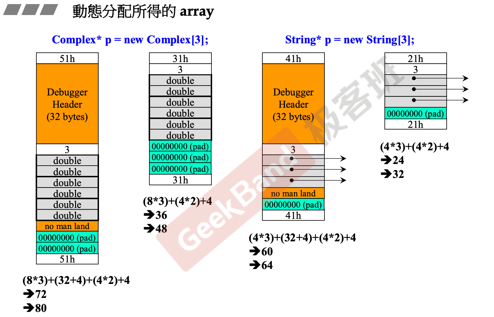
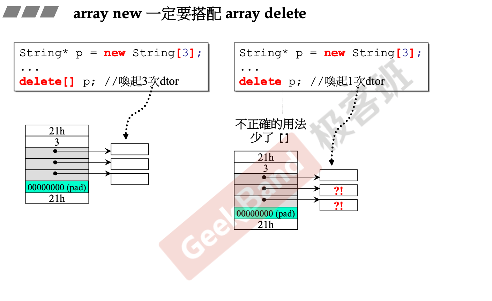
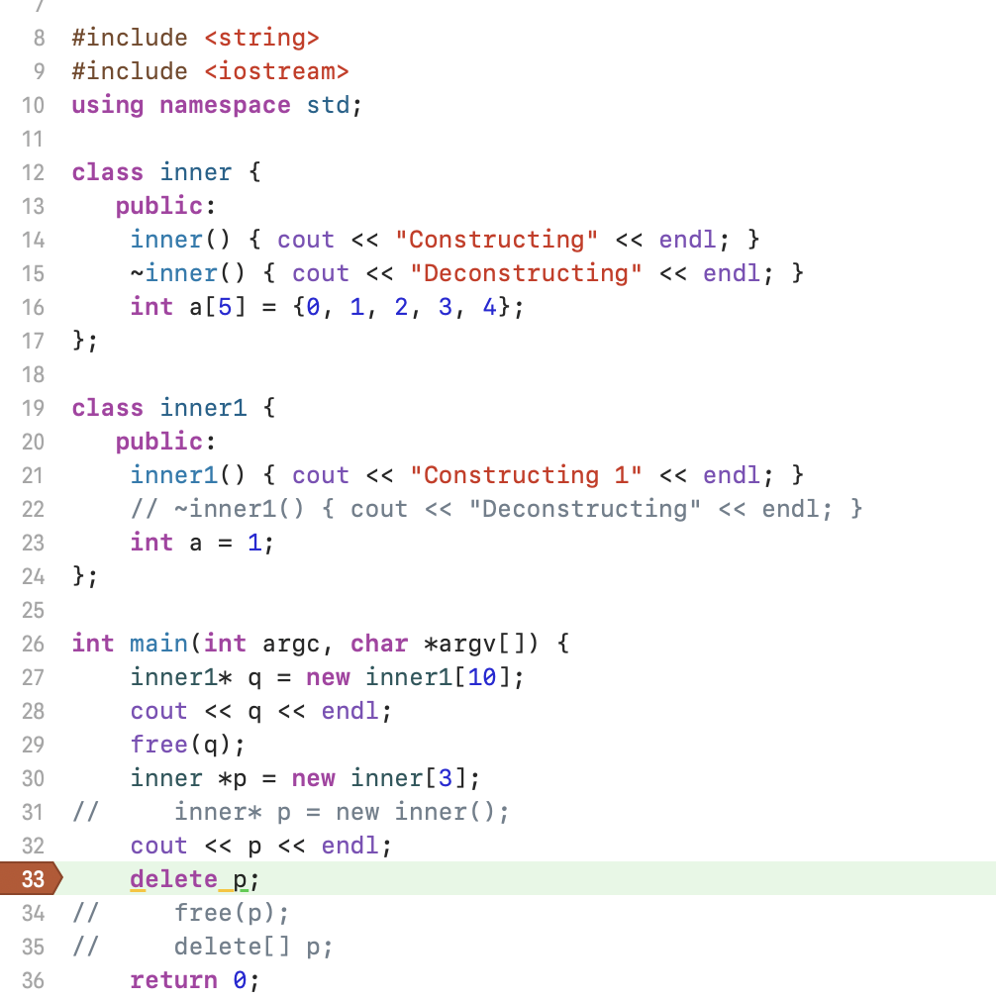
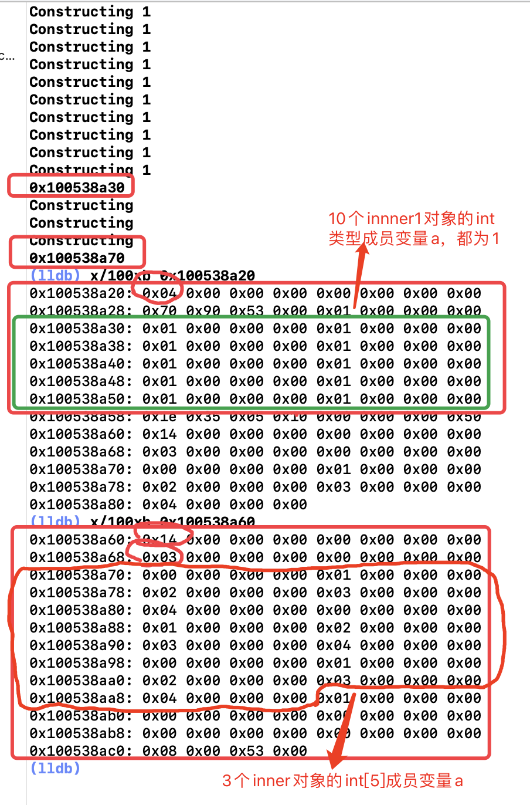

# 动态内存分配

## Introduction

### new/delete

```c++
Complex* pc = new Complex (1,2);
...
delete pc;
```

- new先分配memory再调用构造函数
- delete先调用析构函数再释放memory

```c++
// new
void* mem = operator new (sizeof (Complex));	// 内部调用malloc
pc = static_cast<Complex*> (mem);
pc->Complex::Complex(1,2);

// delete
Complex::~Complex (pc);
operator delete( pc);		// 内部调用free
```

## Memory Block in VC

### Object



以之前实现的Complex和String类为例，详细看看类对象的内存块的信息：

- 32位机器下内存单元为4 bytes；
- 红色区域代表内存块Cookie：记录整块内存的大小，用于回收内存
- 灰色区域为Debug信息
- 绿色为实际对象申请的内存
- 青色为对齐用内存块：VC编译器的内存块为16字节对齐。

**Complex**对象在Debug模式下的总内存使用情况为：两个double变量8bytes，Debug Header Infos 36bytes，内存块头尾8bytes，总计52bytes，由于VC编译器需要16字节对齐，因此还需要12字节的padding。

由于16字节对齐，因此内存块cookie中的值的最后四位总是0，这时OS可以借用这4位作为flag，用于记录该内存块的使用状态，1为外部使用，0为回收，由于这时在申请内存，所以这个Complex对象的Cookie值为0x41。

**String**对象在内存中之包含一个指针成员，一个指针占用4bytes。

### Obejct Array



- array对象除了单独的数据内存外，还会维护一个array长度的数据，单独占用4bytes

**注**：array new一定要搭配array delete使用。在上文中讲过，在delete对象的时候，会先调用对象类的析构函数，再释放内存。p是一个对象指针（数组对象），假如使用`delete p`释放内存，首先会调用p此时所指向的对象的析构函数，释放该对象申请的空间，另外由于数组对象的内存是连续分配的，因此实际上在释放内存的时候会删除p中所有的**对象**（释放整个数组内存块），对于包含指针对象的类来说，由于只调用了一次析构函数，p指针所指向的其余对象中指针成员所指向的内存无法得到正确释放，这样会导致内存泄漏。



## new/delete配对使用问题

在网上的大多数面试八股文中，都会提到一个经典的问题：new和delete，new[]和delete[]的配对使用。上文在一定程度上回答了这个问题，但不够详细，接下来就分多钟情况，具体看一看实际效果。

### new[]和delete

从上文中可以看出，当new array object的时候，会在实际申请的内存之前，增加4字节（和操作系统有关，64位系统是8个字节）用于保存array size，上文说过不管是delete还是delete[]都能够删除这整块内存，因为delete也是能够从heap manager获取到memory block size的，两者的区别就是对于析构函数的调用次数。

既然能够获取到申请的内存大小，那么为何在实际测试过程中，程序会报错，其实编译器在底层的实现中，查看汇编代码可以看到delete[]和delete的区别在于delete[]释放内存的时候实际只会将要释放的对象指针的首地址-8字节进行释放，假如使用delete释放数组对象那么这8字节将无法释放，并且由于释放的内存大小是从heap manager获取，释放的大小并不会发生变化，也就是说delete会顺序向后再释放这8个字节导致越界，程序运行出错。

除非符合特殊情况：假如定义的这个类没有析构函数，那么是可以使用delete回收内存的。这其实和具体实现有关，实际的内存分配并不完全如侯捷所说，通过`lldb`查看下面代码的内存分配情况，可以发现：





我是64位操作系统所以编译器增加的部分部分8字节对齐，并且是小端序，申请的内存也没有padding。

从上图可以看出，分别向前16字节查看两个指针所指向地址的内容会发现：

- 内存中记录的是单个对象的内存大小，而不是整个数组对象的内存大小；
- 只有具备析构函数的类对象才能够生成正确的array size（进入heap manager中）；
- 尾部并没有记录申请的内存大小。

假如没有自定义的析构函数，那么编译器就认为这个类没有调用析构函数的必要，即在释放内存时不需要调用析构函数，也就没有生成array size信息的必要，释放内存时直接释放就好，因此可以成功调用。

**注：这里有一个误区，对于不带析构函数的类，编译器只会为其添加默认析构函数的声明，而不是定义，除非这个类的成员变量中包含具有明确定义的析构函数的类对象！**

### new和delete[]

delete[]会去释放首地址-4字节的内存，而new出来的单个对象并不会生成这4个字节的信息，这是一种非法访问，程序会正常报错。

### new和free

malloc/free的一大区别在于new/delete是服务于C++类，根本区别在于new/delete增加了调用构造/析构函数的过程，假如new的类是内置类型或者是不带自定义析构函数的类，也即这个类没有调用析构函数的必要，那么是可以使用free去释放的。

### new[]和free

行为结果与new[]和delete一致，不再赘述。

至于malloc和delete的配对使用我做过一些简单测试是可以正常调用的，不再纠结于细节了。

## static

- 对象的non-static成员函数通过对象的地址生成的this指针，来处理non-static成员变量
- 对象的static成员函数脱离对象单独存在静态区，由于缺乏this指针，因此无法处理累的non-static成员变量
- 对象的static成员函数可以直接通过class name调用：`Account::set_rate(5.0)`


- 类的static具有一种经典的使用模式：单例模式