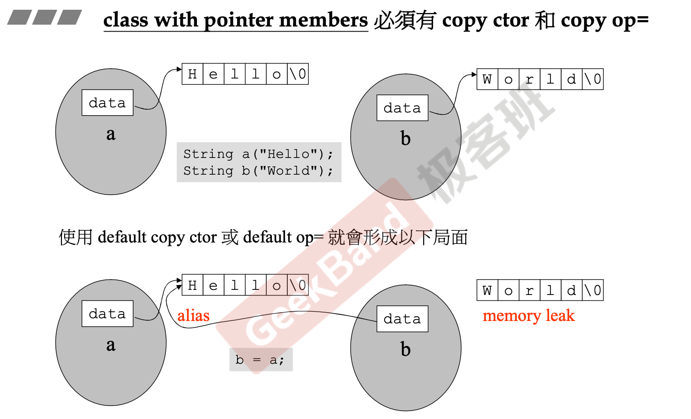
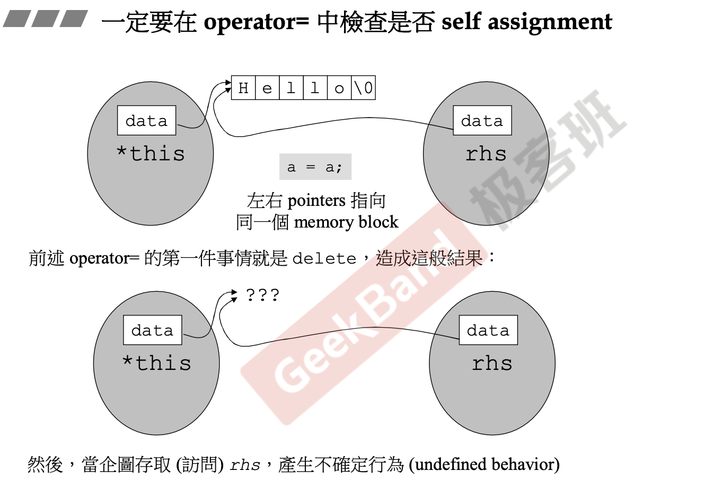

# String

## Introduction

类的经典分类方式是根据类内是否有指针成员进行划分。

```c++
#ifndef __MYSTRING__
#define __MYSTRING__

#include <cstring>
#include <iostream>
using namespace std;

class String
{
public:                                 
   String(const char* cstr=0);                     
   String(const String& str);                    
   String& operator=(const String& str);         
   ~String();                                    
   char* get_c_str() const { return m_data; }
private:
   char* m_data;
};

ostream& operator<<(ostream& os, const String& str)
{
   os << str.get_c_str();
   return os;
}

#endif
```

## 构造函数和析构函数

```c++
inline
String::String(const char* cstr = 0)
{
   if (cstr) {
      m_data = new char[strlen(cstr)+1];
      strcpy(m_data, cstr);
   }
   else {   
      m_data = new char[1];
      *m_data = '\0';
   }
}

inline
String::~String()
{
   delete[] m_data;
}
```

- 构造函数传参使用const确保不会再构造函数中修改初始值。
- 指针成员需要动态申请内存空间，并完成数值拷贝，对于指针变量必须要进行非空检查。
- 含有指针成员的类的析构函数中需要使用delete删除在构造过程中申请的所有空间。

## 拷贝构造和拷贝赋值

带有指针成员的类必须定义拷贝构造函数和拷贝赋值函数，否则在不正确使用的情况下会发生内存泄漏。

```c++
String a ("Hello");
String b ("World");
```

C++默认的拷贝构造和拷贝赋值函数是原样拷贝，可以简单理解为浅拷贝，对于指针只是简单修改指针指向的地址，而不是将指针内容进行拷贝。

上述定义并初始化了两个String类对象a和b，在初始化是为两个对象各自申请了一块内存空间用于存储字符串，假如这时用户使用赋值符号：

```c++
b = a;
```

由于没有自定义的拷贝赋值函数，那么在赋值之后b的成员变量str字符串指针也将指向a.str，即类似于引用，b.str为a.str的别名，而原本为b.str申请的用于存储“World”字符串的内存空间将泄漏。



```c++
inline
String& String::operator=(const String& str)
{
   if (this == &str)
      return *this;

   delete[] m_data;
   m_data = new char[ strlen(str.m_data) + 1 ];
   strcpy(m_data, str.m_data);
   return *this;
}

inline
String::String(const String& str)
{
   m_data = new char[ strlen(str.m_data) + 1 ];
   strcpy(m_data, str.m_data);
}
```

- 在拷贝赋值函数中必须检查自我赋值，否则在自我赋值时将直接delete原有数据，导致错误调用。



