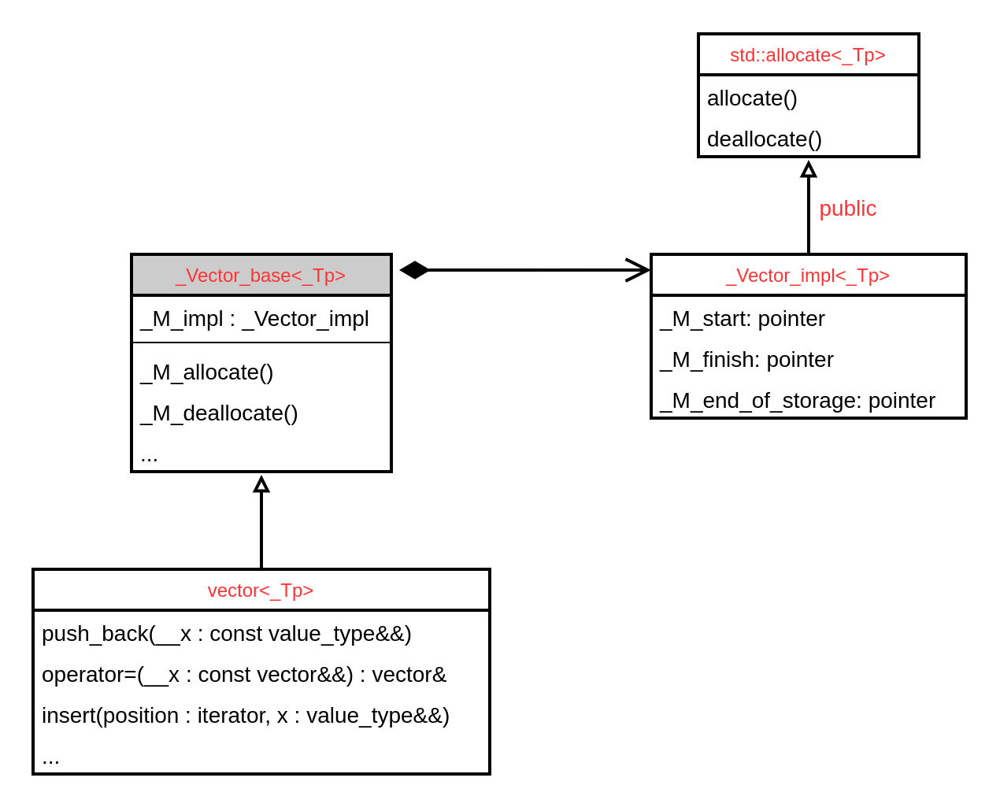
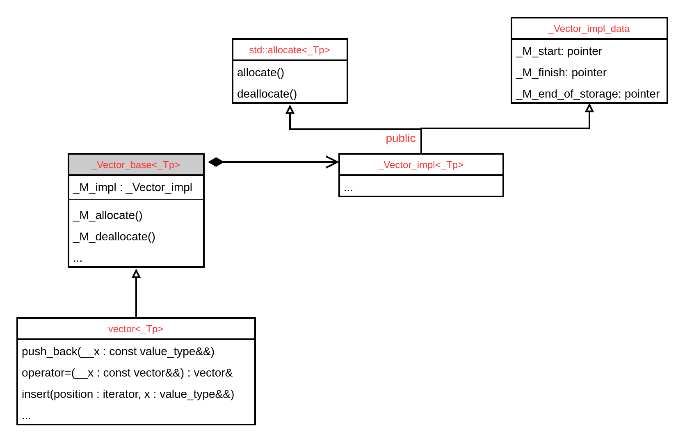
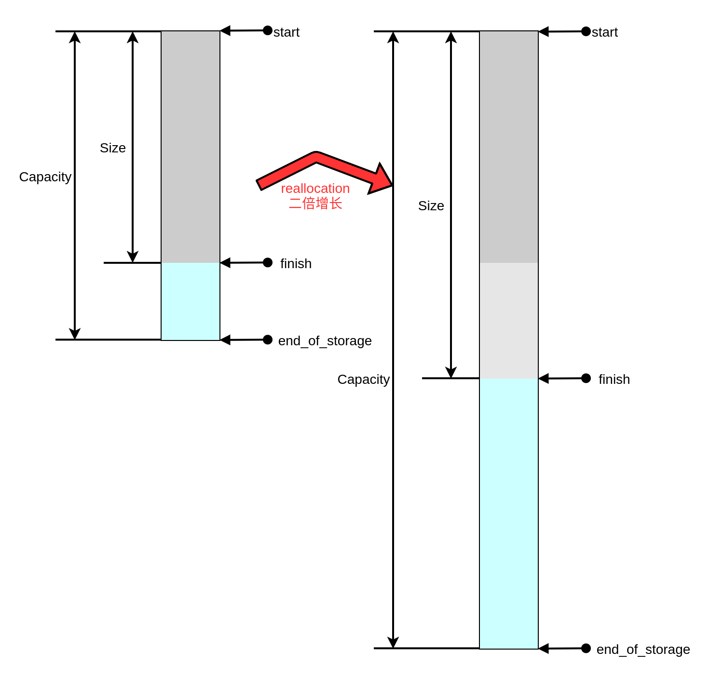
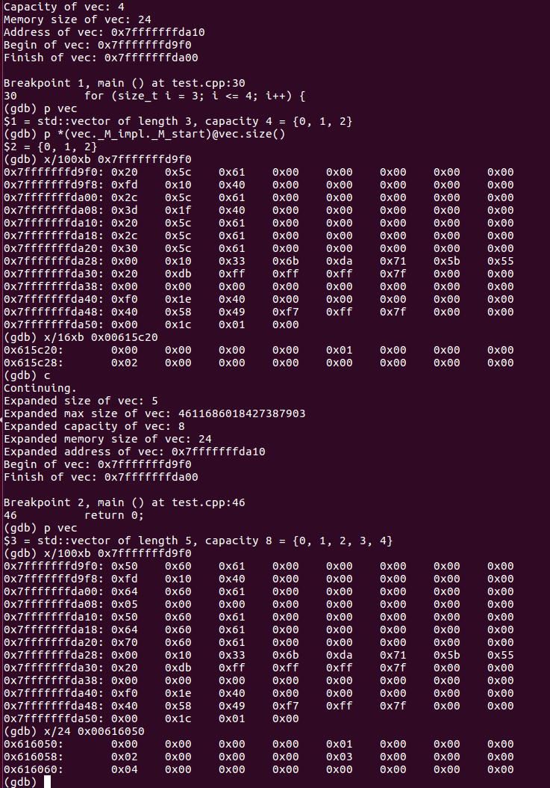

# std::vector

## Overview

本文主要是侯捷《STL与泛型编程》课程关于`std::vector`容器的学习笔记，此外，在课程的基础上做了一些简单的验证和实验，加深了对`std::vector`对象内存布局的理解。本文主要包含以下内容：

- `std::vector`的变化：从GCC 2.9到GCC 4.9到GCC 13.0
- `std::vector`的reallocation动态拓展机制
- `std::vector`的迭代器
- 部分成员函数的实现
- 一个简单的测试实验

## std::vector in GCC 2.9

```c++
// gcc 2.9 stl_vector.h
template<class T, class Alloc=alloc>
class vector {
public:
    typedef T 			value_type;
    typedef value_type* iterator;
    typedef value_type& reference;
    typedef size_t 		size_type;

protected:
    iterator start;
    iterator finish;
    iterator end_of_storage;
public:
    iterator begin() { return start; }
    const_iterator begin() const { return start; }
    iterator end() { return finish; }
    size_type size() const { return size_type(end() - begin()); }
    size_type max_size() const { return size_type(-1) / sizeof(T); }
    size_type capacity() const { return size_type(end_of_storage - begin()); }
    bool empty() const { return begin() == end(); }
    reference operator[](size_type n) { return *(begin() + n); }
    ...
};
```

std::vector与其他容器不同的地方在于作为使用连续空间的Container它只使用了三个指针就能够控制整个对象。

## std::vector in GCC 4.9



GCC 4.9中大部分容器都采用了handle-body的设计，用于封装隐藏实现，Container类继承自Base类，Base类含有一个Implementation对象，所有操作都由Implementation类的成员完成。事实上核心并没有变化，只是修改了实现的设计。

唯一无法理解的地方在于Implementation类公有继承自分配器，这事实上违反了公有继承is-a的含义，无论怎么说Container都不可能是一个分配器的子类，个人理解的做法应该是采用Composition关系而不是Inheritance关系。

## std::vector in GCC 13



GCC 13和GCC 4.9的实现没有太大区别，只是将Implementation类的数据部分单独抽象，并改成了多继承。

目前最新版的Container都是在GCC 4.9上做小改动，大部分Container都是将data成员单独抽象，并拥有Container_data->[Container_data_base]这样的继承关系，然后Composite一个Container_data_base对象，`std::vector`是一个特例。

注：随着发展STL的实现变得越来越复杂，侯捷多次在课程中强调这种设计的多余，因为它增加了理解的难度。课程首发于2015年，然而时至今日我也无法理解这种设计的先进性，只能归因于这是符合C++发展的需要。

## 动态拓展：二倍增长



上图展示了一个capacity为8，size为6的std::vector对象在插入第九个元素时发生的reallocation过程，当需要拓展内存时，std::vector对象的分配器将找一块能存下两倍大小的内存，并将旧数据拷贝到新内存地址，然后再插入新元素，假如无法找到两倍大的新内存，那么这个对象生命周期将会终止。

```c++
// gcc 2.9 stl_vector.h
template <class T, class Alloc>
void vector<T, Alloc>::insert_aux(iterator position, const T& x) {
	// insert()调用
    if (finish != end_of_storage) {
        construct(finish, *(finish - 1));
        ++finish;
        T x_copy = x;
        copy_backward(position, finish - 2, finish - 1);
        *position = x_copy;
    }
    else {
        const size_type old_size = size();
        // 数据个数从1开始逐次增大两倍
        const size_type len = old_size != 0 ? 2 * old_size : 1;
        iterator new_start = data_allocator::allocate(len);
        iterator new_finish = new_start;
        try {
        // 拷贝源vector，position前半段数据
        new_finish = uninitialized_copy(start, position, new_start);
        construct(new_finish, x);	// 插入元素
        ++new_finish;
        // 拷贝源vector，position后半段数据，insert()调用
        new_finish = uninitialized_copy(position, finish, new_finish);
        }
        catch(...) {
        destroy(new_start, new_finish); 
        data_allocator::deallocate(new_start, len);
        throw;
        }

		// 回收vector对象占用的旧内存
        destroy(begin(), end());
        deallocate();
        // 修改指针
        start = new_start;
        finish = new_finish;
        end_of_storage = new_start + len;
    }
}

void push_back(const T& x) {
    if (finish != end_of_storage) {
        construct(finish, x);
        ++finish;
    }
    else
        insert_aux(end(), x);
}
```

`push_back()`的动态拓展借由`insert_aux()`完成，一个事实是vector的每一次拓展内存都将会发生大量的数据拷贝和析构。

```c++
// gcc 13 gcc/libstdc++-v3/include/bits/stl_vector.h
// Called by _M_fill_insert, _M_insert_aux etc.
size_type _M_check_len(size_type __n, const char* __s) const {
    if (max_size() - size() < __n)
	  __throw_length_error(__N(__s));

    const size_type __len = size() + std::max(size(), __n);       // 二倍长
    return (__len < size() || __len > max_size()) ? max_size() : __len;
}

pointer _M_allocate(size_t __n) {
    typedef __gnu_cxx::__alloc_traits<_Tp_alloc_type> _Tr;
    return __n != 0 ? _Tr::allocate(_M_impl, __n) : pointer();
}

// gcc 13 gcc/libstdc++-v3/include/bits/vector.tcc
template<typename _Tp, typename _Alloc>
void vector<_Tp, _Alloc>::_M_realloc_insert(iterator __position, const _Tp& __x) {
    const size_type __len = _M_check_len(size_type(1), "vector::_M_realloc_insert");      // 2倍当前大小
    const size_type __elems_before = __position - begin();
    pointer __new_start(this->_M_allocate(__len));
    pointer __new_finish(__new_start);
    __try {
	  // The order of the three operations is dictated by the C++11
	  // case, where the moves could alter a new element belonging
	  // to the existing vector.  This is an issue only for callers
	  // taking the element by lvalue ref (see last bullet of C++11
	  // [res.on.arguments]).
	  _Alloc_traits::construct(this->_M_impl, __new_start + __elems_before, __x);
	  __new_finish = pointer();

	  __new_finish = std::__uninitialized_move_if_noexcept_a(this->_M_impl._M_start, __position.base(), __new_start, _M_get_Tp_allocator();

	  ++__new_finish;

	  __new_finish = std::__uninitialized_move_if_noexcept_a(__position.base(), this->_M_impl._M_finish, __new_finish, _M_get_Tp_allocator());
	}__catch(...) {
	  if (!__new_finish)
	    _Alloc_traits::destroy(this->_M_impl,
				   __new_start + __elems_before);
	  else
	    std::_Destroy(__new_start, __new_finish, _M_get_Tp_allocator());
	  _M_deallocate(__new_start, __len);
	  __throw_exception_again;
	}
      std::_Destroy(this->_M_impl._M_start, this->_M_impl._M_finish, _M_get_Tp_allocator());
      _M_deallocate(this->_M_impl._M_start, this->_M_impl._M_end_of_storage - this->_M_impl._M_start);
      this->_M_impl._M_start = __new_start;
      this->_M_impl._M_finish = __new_finish;
      this->_M_impl._M_end_of_storage = __new_start + __len;
    }

// gcc stl_vector.h
void push_back(const value_type& __x) {
    if (this->_M_impl._M_finish != this->_M_impl._M_end_of_storage) {
	    _Alloc_traits::construct(this->_M_impl, this->_M_impl._M_finish, __x);
	    ++this->_M_impl._M_finish;
    } else
	  _M_realloc_insert(end(), __x);
}
```

GCC 13的实现和GCC 2.9没有太大区别，基本是由于分配器和设计修改引入的常规改动。

## std::vector的iterator

### GCC 2.9

在GCC 2.9的实现中`std::vector<T>::iterator`的类型实际是`T*`，这是因为对于续内存空间的访问，可以直接使用指针，在`iterator_traints`时将使用指针类型的特化：

```c++
// gcc 2.9 stl_iterator_base_types.h
/// Partial specialization for pointer types.
  template<typename _Tp>
    struct iterator_traits<_Tp*>
    {
      typedef random_access_iterator_tag iterator_category;
      typedef _Tp                         value_type;
      typedef ptrdiff_t                   difference_type;
      typedef _Tp*                        pointer;
      typedef _Tp&                        reference;
    };
```

### GCC 4.9

```c++
// gcc 4.9 gcc/libstdc++-v3/include/bits/stl_iterator.h
  template<typename _Iterator, typename _Container>
    class __normal_iterator
    {
    protected:
      _Iterator _M_current;

      typedef iterator_traits<_Iterator>		__traits_type;

    public:
      typedef _Iterator					iterator_type;
      typedef typename __traits_type::iterator_category iterator_category;
      typedef typename __traits_type::value_type  	value_type;
      typedef typename __traits_type::difference_type 	difference_type;
      typedef typename __traits_type::reference 	reference;
      typedef typename __traits_type::pointer   	pointer;
      ...
    }

// gcc 4.9 gcc/libstdc++-v3/include/bits/allocator.h
  template<typename _Tp>
    class allocator: public __allocator_base<_Tp>
    {
   public:
      typedef size_t     size_type;
      typedef ptrdiff_t  difference_type;
      typedef _Tp*       pointer;
      typedef const _Tp* const_pointer;
      typedef _Tp&       reference;
      typedef const _Tp& const_reference;
      typedef _Tp        value_type;
      ...
      template<typename _Tp1>
        struct rebind
        { typedef allocator<_Tp1> other; };
    }

// gcc 4.9 gcc/libstdc++-v3/include/bits/alloc_traits.h
  template<typename _Alloc, typename _Tp>
    struct __alloctr_rebind<_Alloc, _Tp, true>
    {
      typedef typename _Alloc::template rebind<_Tp>::other __type;
    };

  template<typename _Alloc>
    struct allocator_traits
    {
      /// The allocator type
      typedef _Alloc allocator_type;
      /// The allocated type
      typedef typename _Alloc::value_type value_type;
#define _GLIBCXX_ALLOC_TR_NESTED_TYPE(_NTYPE, _ALT) \
  private: \
  template<typename _Tp> \
    static typename _Tp::_NTYPE _S_##_NTYPE##_helper(_Tp*); \
  static _ALT _S_##_NTYPE##_helper(...); \
    typedef decltype(_S_##_NTYPE##_helper((_Alloc*)0)) __##_NTYPE; \
  public:

_GLIBCXX_ALLOC_TR_NESTED_TYPE(pointer, value_type*)
      /**
       * @brief   The allocator's pointer type.
       *
       * @c Alloc::pointer if that type exists, otherwise @c value_type*
      */
      typedef __pointer pointer;
      ...
      template<typename _Tp>
	using rebind_alloc = typename __alloctr_rebind<_Alloc, _Tp>::__type;
    }

// gcc 4.9 gcc/libstdc++-v3/include/ext/alloc_traits.h
template<typename _Alloc>
  struct __alloc_traits
#if __cplusplus >= 201103L
  : std::allocator_traits<_Alloc>
#endif
  {
    typedef _Alloc allocator_type;
#if __cplusplus >= 201103L
    typedef std::allocator_traits<_Alloc>           _Base_type;
    typedef typename _Base_type::value_type         value_type;
    typedef typename _Base_type::pointer            pointer;
    typedef typename _Base_type::const_pointer      const_pointer;
    typedef typename _Base_type::size_type          size_type;
    typedef typename _Base_type::difference_type    difference_type;
    // C++11 allocators do not define reference or const_reference
    typedef value_type&                             reference;
    typedef const value_type&                       const_reference;
    ...
    template<typename _Tp>
      struct rebind
      { typedef typename _Base_type::template rebind_alloc<_Tp> other; };
  }


// gcc 4.9 gcc/libstdc++-v3/include/bits/stl_vector.h
  template<typename _Tp, typename _Alloc>
    struct _Vector_base
    {
      typedef typename __gnu_cxx::__alloc_traits<_Alloc>::template
        rebind<_Tp>::other _Tp_alloc_type;
      typedef typename __gnu_cxx::__alloc_traits<_Tp_alloc_type>::pointer
       	pointer;
		...
    }
  template<typename _Tp, typename _Alloc = std::allocator<_Tp> >
    class vector : protected _Vector_base<_Tp, _Alloc>
    {
      typedef _Vector_base<_Tp, _Alloc>			 _Base;

    public:
      typedef typename _Base::pointer                    pointer;
      typedef __gnu_cxx::__normal_iterator<pointer, vector> iterator;
	  ...
	}
	
```

从`std::vector`开始追踪，可以先看到`__normal_iterator`中只有一个`_Iterator`也就是`pointer`类型的数据成员`_M_current`，然后回溯`pointer`可以知道它其实是`_Tp*`，所以`std::vector<T>::iterator`实际就是`T*`。回溯的过程涉及到分配器的特化，实际最后会追溯到`std::allocator`类。

整个rebind的过程比较复杂，上面的代码列出了C++11的核心部分（C++98比较简单，`__gnu_cxx::alloc_traits<_Alloc>`直接就可以追溯到`std::allocator`类），`_Tp_alloc_type`实际就是`std::allocator<_Tp>`。

唯一困惑的地方就是`allocator_traits`中`__pointer`的定义，这里使用了宏定义判断，根据GCC 13新的实现（在2015年GCC 4.9的宏定义被改为detection idiom）：

```c++
    template<typename _Tp>
      using __pointer = typename _Tp::pointer;

	  /**
       * @brief   The allocator's pointer type.
       *
       * @c Alloc::pointer if that type exists, otherwise @c value_type*
      */
      using pointer = __detected_or_t<value_type*, __pointer, _Alloc>;
```

和注释我的理解如下：

- 假如`Alloc::pointer`存在的话，使用`Alloc::pointer`
- 假如`Alloc::poniter`不存在的话，使用`value_type*`

实际上无论哪种情况这个`pointer`都是`_Tp*`。

GCC 13的实现相对GCC 4.9只是增加了新的C++标准的使用，核心没有改动。如前文所说，这种改进实际是没有必要的。区别在于，GCC 2.9的vector的iterator是pointer iterator，而在GCC 4.9之后，vecotr的iterator和其他容器一样变为了一个对象，于是在进行`iterator_traits`的时候会走class iterator而不是GCC 2.9的pointer iterator，但实际上我们可以看到`__normal_iterator`中的`iterator_traits`实际还是pointer iterator的traits，可以理解为新版给旧版的`_Tp*`外面封装了一个iterator adapter，使它能支持容器需要的5个associated types。

## 内存分布

```c++
#include <iostream>
#include <vector>

int main()
{
    std::vector<int> vec;
    vec.push_back(0);
    vec.push_back(1);
    vec.push_back(2);

    std::vector<int>::iterator begin_ite = vec.begin();
    std::vector<int>::iterator end_ite = vec.end();
    std::cout << "Size of vec: " << vec.size() << std::endl;
    std::cout << "Max size of vec: " << vec.max_size() << std::endl;
    std::cout << "Capacity of vec: " << vec.capacity() << std::endl;
    std::cout << "Memory size of vec: " << sizeof(vec) << std::endl;
    std::cout << "Address of vec: " << &vec << std::endl;
    std::cout << "Begin of vec: " << &begin_ite << std::endl;
    std::cout << "Finish of vec: " << &end_ite << std::endl;

    for (size_t i = 3; i <= 4; i++) {
        vec.push_back(i);
    }

    begin_ite = vec.begin();
    end_ite = vec.end();

    std::cout << "Expanded size of vec: " << vec.size() << std::endl;
    std::cout << "Expanded max size of vec: " << vec.max_size() << std::endl;
    std::cout << "Expanded capacity of vec: " << vec.capacity() << std::endl;
    std::cout << "Expanded memory size of vec: " << sizeof(vec) << std::endl;
    std::cout << "Expanded address of vec: " << &vec << std::endl;
    std::cout << "Begin of vec: " << &begin_ite << std::endl;
    std::cout << "Finish of vec: " << &end_ite << std::endl;

    return 0;
}
```



从上文可以知道`std::vector`的数据成员是三个指针，在64为系统中占用24字节，使用gdb查看vector对象的24个字节中的数据可以发现它们确实对应了`_M_start`，`_M_finish`，`_M_end_of_storage`三个指针的地址，打印指针的地址即可以访问到vector对象中的数据元素。此外还可以看到在内存发生动态拓展时内存确实是重新分配了。

