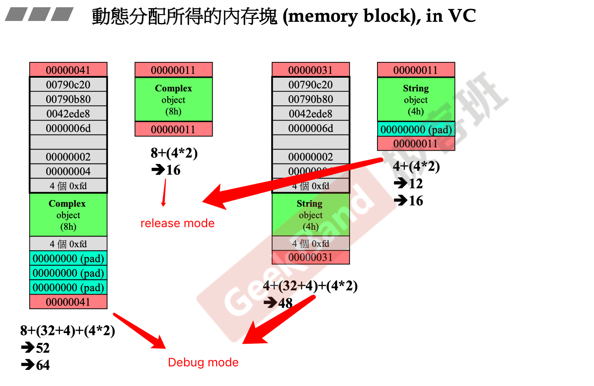
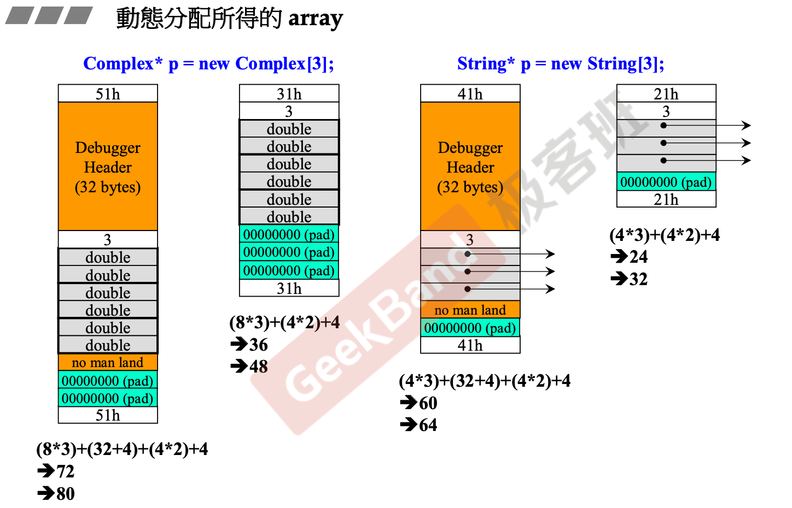
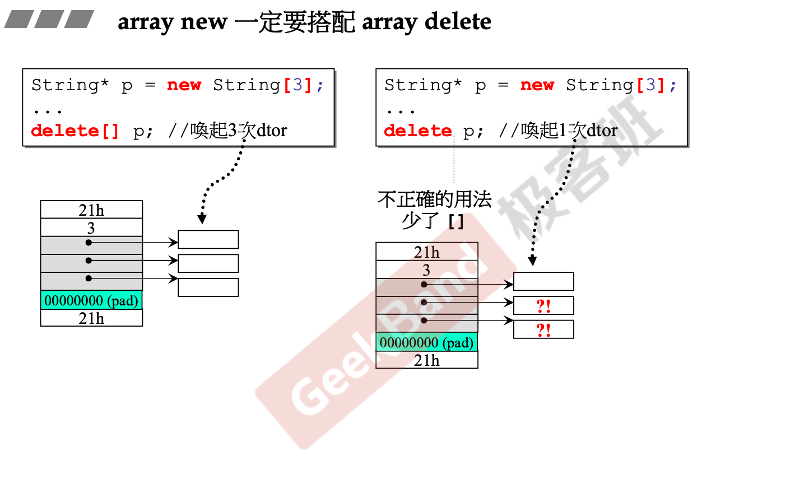
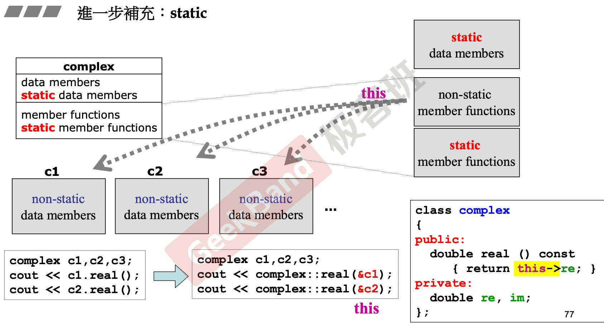

# 动态内存分配

## Introduction

### new/delete

```c++
Complex* pc = new Complex (1,2);
...
delete pc;
```

- new先分配memory再调用构造函数
- delete先调用析构函数再释放memory

```c++
// new
void* mem = operator new (sizeof (Complex));	// 内部调用malloc
pc = static_cast<Complex*> (mem);
pc->Complex::Complex(1,2);

// delete
Complex::~Complex (pc);
operator delete( pc);		// 内部调用free
```


## Memory Block in VC

### Object



以之前实现的Complex和String类为例，详细看看类对象的内存块的信息：

- 32位机器下内存单元为4 bytes；
- 红色区域代表内存块Cookie：记录整块内存的大小，用于回收内存
- 灰色区域为Debug信息
- 绿色为实际对象申请的内存
- 青色为对齐用内存块：VC编译器的内存块为16字节对齐。

**Complex**对象在Debug模式下的总内存使用情况为：两个double变量8bytes，Debug Header Infos 36bytes，内存块头尾8bytes，总计52bytes，由于VC编译器需要16字节对齐，因此还需要12字节的padding。

由于16字节对齐，因此内存块cookie中的值的最后四位总是0，这时OS可以借用这4位作为flag，用于记录该内存块的使用状态，1为外部使用，0为回收，由于这时在申请内存，所以这个Complex对象的Cookie值为0x41。

**String**对象在内存中之包含一个指针成员，一个指针占用4bytes。

### Obejct Array



- array对象除了单独的数据内存外，还会维护一个array长度的数据，单独占用4bytes


**注**：array new一定要搭配array delete使用：

在上文中讲过，在delete对象的时候，会先调用对象类的析构函数，再释放内存。p是一个对象指针（数组对象），假如使用`delete p`释放内存，首先会调用p此时所指向的对象的析构函数，释放该对象申请的空间，另外由于数组对象的内存是连续分配的，因此实际上在释放内存的时候会删除p中所有的**对象**（释放整个数组内存块），对于包含指针对象的类来说，由于只调用了一次析构函数，p指针所指向的其余对象中指针成员所指向的内存无法得到正确释放，这样会导致内存泄漏。



## static

- 对象的non-static成员函数通过对象的地址生成的this指针，来处理non-static成员变量
- 对象的static成员函数脱离对象单独存在静态区，由于缺乏this指针，因此无法处理累的non-static成员变量
- 对象的static成员函数可以直接通过class name调用：`Account::set_rate(5.0)`



- 类的static具有一种经典的使用模式：单例模式