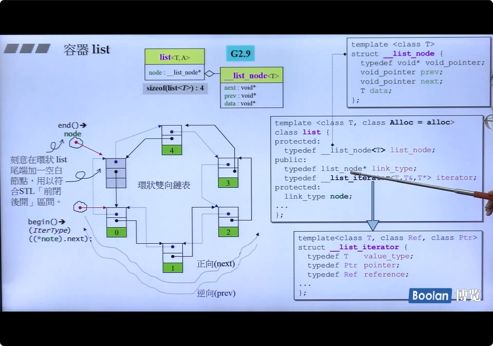
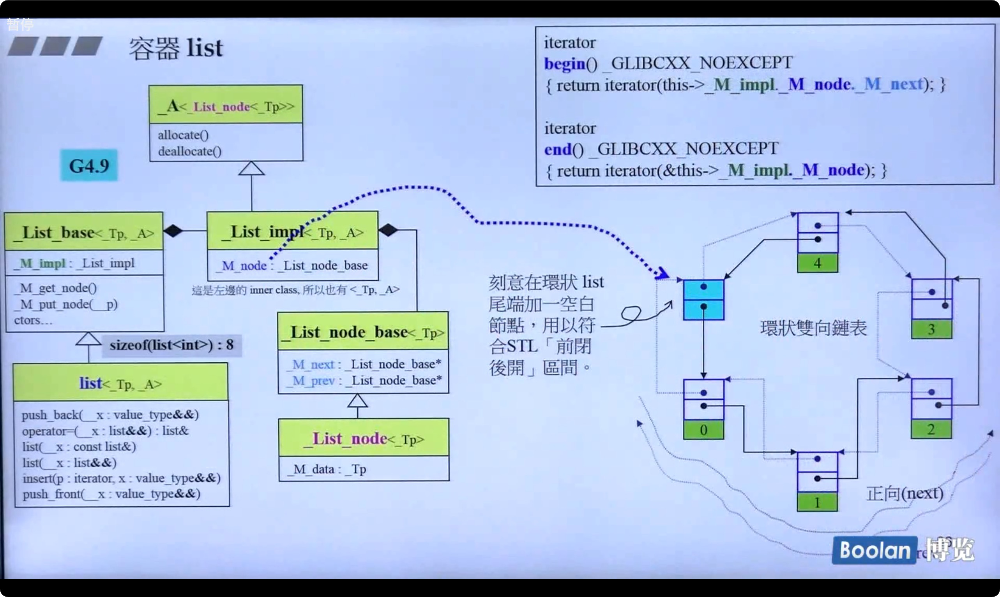
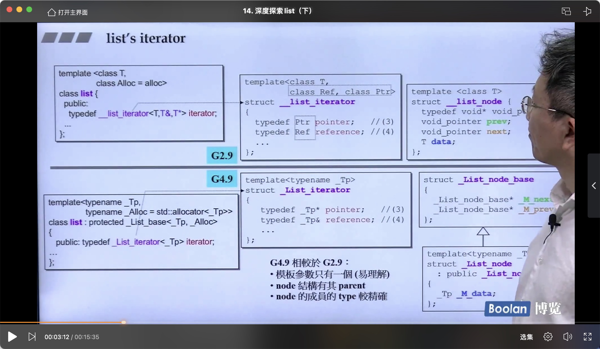
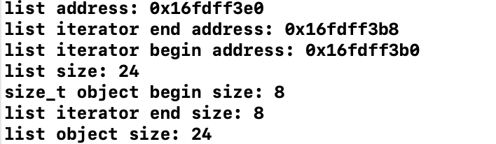
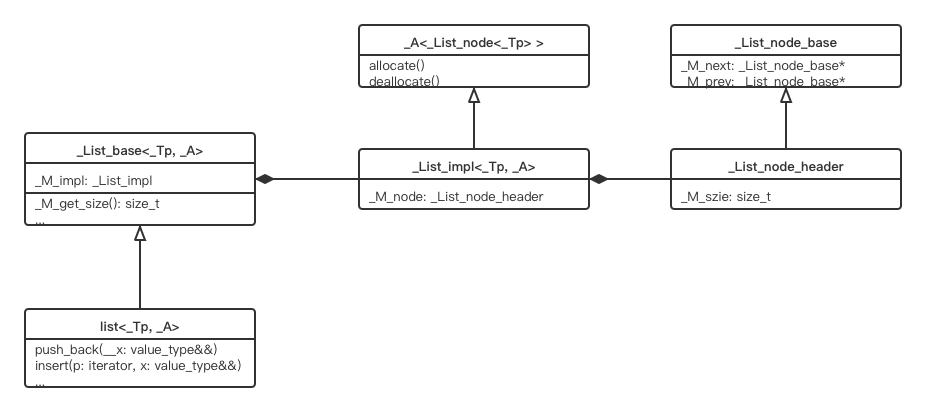
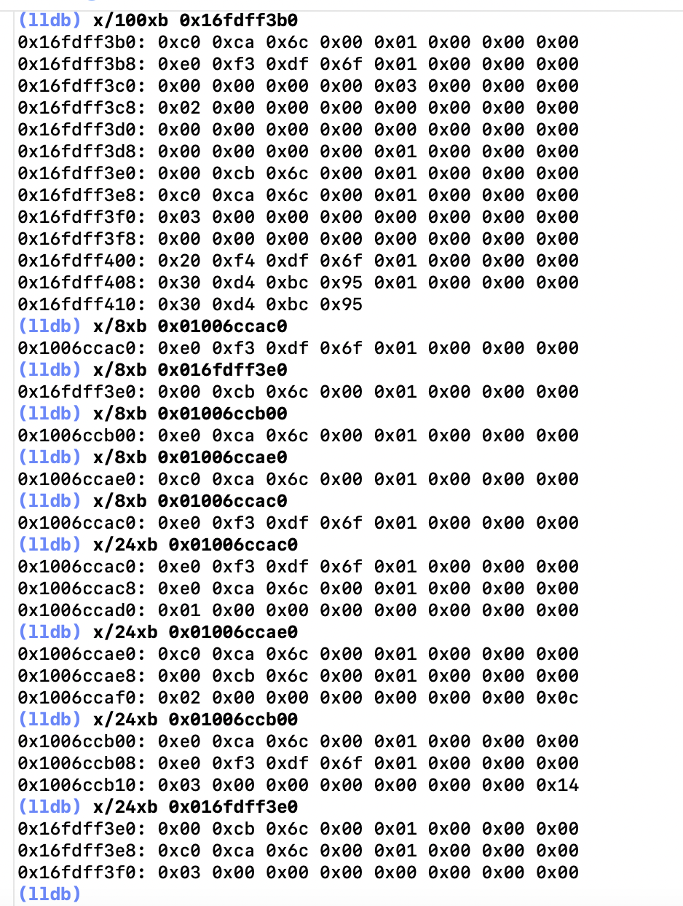
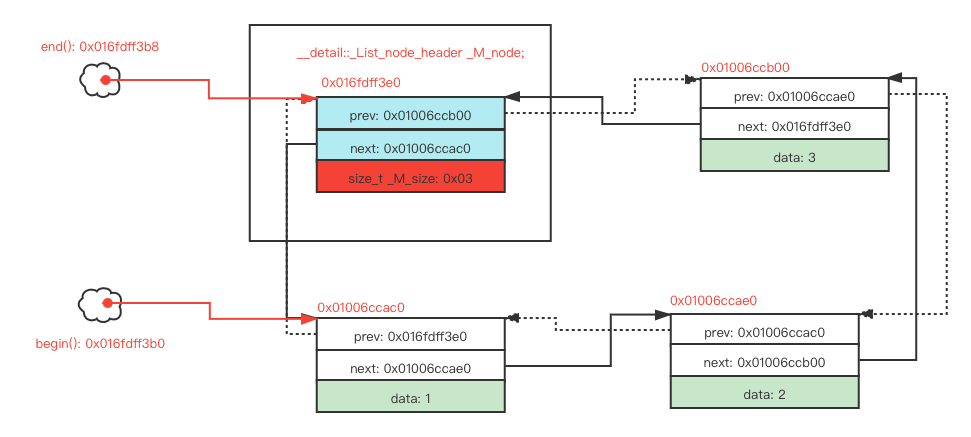

# std::list

## Overview

本文主要是侯捷《STL与泛型编程》课程关于`std::list`容器的学习笔记，此外，在课程的基础上做了一些简单的验证和实验，加深了对`std::list`对象内存布局的理解。本文主要包含以下内容：

- `std::list`的变化：从GCC 2.9到GCC 4.9到GCC 13.0
- `std::list`的迭代器
- 部分成员函数的实现
- 一个简单的测试实验

## std::list in GCC 2.9



GCC 2.9中`std::list`实现比较简单，只有一个Delegation关系，`list`中包含一个`__list_node`类型的指针对象。

可以看到这个实现比较粗糙：

- `__list_node`中的指针对象是`void*`类型，意味着在进行操作的时候会发生类型转换；
- 迭代器的定义传递的参数过多，所有需要的类型都通过template传递；

## std::list in GCC 4.9



GCC 4.9中`std::list`的设计变得更加符合C++的风格，充分运用了C++的特性，加入继承和多态，使用Composition关系组织各个类。



## _List_node

```c++
// gcc 11 stl_list.h    
    /// Common part of a node in the %list.
    struct _List_node_base
    {
      _List_node_base* _M_next;
      _List_node_base* _M_prev;

      static void
      swap(_List_node_base& __x, _List_node_base& __y) _GLIBCXX_USE_NOEXCEPT;

      void
      _M_transfer(_List_node_base* const __first,
		  _List_node_base* const __last) _GLIBCXX_USE_NOEXCEPT;

      void
      _M_reverse() _GLIBCXX_USE_NOEXCEPT;

      void
      _M_hook(_List_node_base* const __position) _GLIBCXX_USE_NOEXCEPT;

      void
      _M_unhook() _GLIBCXX_USE_NOEXCEPT;
    };

  /// An actual node in the %list.
  template<typename _Tp>
    struct _List_node : public __detail::_List_node_base
    {
#if __cplusplus >= 201103L
      __gnu_cxx::__aligned_membuf<_Tp> _M_storage;
      _Tp*       _M_valptr()       { return _M_storage._M_ptr(); }
      _Tp const* _M_valptr() const { return _M_storage._M_ptr(); }
#else
      _Tp _M_data;
      _Tp*       _M_valptr()       { return std::__addressof(_M_data); }
      _Tp const* _M_valptr() const { return std::__addressof(_M_data); }
#endif
    };
```


## _List_iterator

```c++
// gcc 11 stl_list.h
  /**
   *  @brief A list::iterator.
   *
   *  All the functions are op overloads.
  */
  template<typename _Tp>
    struct _List_iterator
    {
      typedef _List_iterator<_Tp>		_Self;
      typedef _List_node<_Tp>			_Node;

      typedef ptrdiff_t				difference_type;
      typedef std::bidirectional_iterator_tag	iterator_category;
      typedef _Tp				value_type;
      typedef _Tp*				pointer;
      typedef _Tp&				reference;

      _List_iterator() _GLIBCXX_NOEXCEPT
      : _M_node() { }

      explicit
      _List_iterator(__detail::_List_node_base* __x) _GLIBCXX_NOEXCEPT
      : _M_node(__x) { }

      _Self
      _M_const_cast() const _GLIBCXX_NOEXCEPT
      { return *this; }

      // Must downcast from _List_node_base to _List_node to get to value.
      _GLIBCXX_NODISCARD
      reference
      operator*() const _GLIBCXX_NOEXCEPT
      { return *static_cast<_Node*>(_M_node)->_M_valptr(); }

      _GLIBCXX_NODISCARD
      pointer
      operator->() const _GLIBCXX_NOEXCEPT
      { return static_cast<_Node*>(_M_node)->_M_valptr(); }

      _Self&
      operator++() _GLIBCXX_NOEXCEPT
      {
	  _M_node = _M_node->_M_next;
	  return *this;
      }

      _Self
      operator++(int) _GLIBCXX_NOEXCEPT
      {
	  _Self __tmp = *this;
	  _M_node = _M_node->_M_next;
	  return __tmp;
      }

      _Self&
      operator--() _GLIBCXX_NOEXCEPT
      {
	  _M_node = _M_node->_M_prev;
	  return *this;
      }

      _Self
      operator--(int) _GLIBCXX_NOEXCEPT
      {
	  _Self __tmp = *this;
	  _M_node = _M_node->_M_prev;
  	  return __tmp;
      }

      _GLIBCXX_NODISCARD
      friend bool
      operator==(const _Self& __x, const _Self& __y) _GLIBCXX_NOEXCEPT
      { return __x._M_node == __y._M_node; }

#if __cpp_impl_three_way_comparison < 201907L
      _GLIBCXX_NODISCARD
      friend bool
      operator!=(const _Self& __x, const _Self& __y) _GLIBCXX_NOEXCEPT
      { return __x._M_node != __y._M_node; }
#endif

      // The only member points to the %list element.
      __detail::_List_node_base* _M_node;
    };
```

总的来说，迭代器是一个_List_node_base型的指针。每种Containers（除vector）都含有一个iterator成员，实现了一系列的操作符重载，用于模拟指针操作。

### operator++()和operator++(int)

```c++
// gcc 11 stl_list.h   
      _Self&
      operator++() _GLIBCXX_NOEXCEPT
      {
	  _M_node = _M_node->_M_next;
	  return *this;
      }

      _Self
      operator++(int) _GLIBCXX_NOEXCEPT
      {
	  _Self __tmp = *this;
	  _M_node = _M_node->_M_next;
	  return __tmp;
      }
```

std::list重载了两个++操作符，这是因为对于++这类单目操作符，可以是++ite或ite++，即有prefix form和postfix form两种形式。

**operator++()**

这是prefix form，即++ite。我们知道前置自增意味着我们需要先自增在返回，因此prefix form的重载比较简单，直接让当前指向下一个节点再**返回引用**即可。

**operator++(int)**

这是postfix form，即ite++。我们知道后置自增意味着我们需要返回当前值再进行自增操作，它的实现分为三步：

- `_Self __tmp = *this;`：调用**拷贝构造**创建一个临时变量来记录原值，注意这个`*this`并不会调用`operator*()`来完成对ite的“解引用”（iterator只是在模拟指针，因此叫解引用并不严谨）。
- `_M_node = _M_node->_M_next;`：当前节点指向下一个节点。
- `return __tmp;`：返回记录下来的原值，注意这里是return by value而不是prefix form中的return by reference。

### operator*()

```c++
// gcc 11 stl_list.h   
      // Must downcast from _List_node_base to _List_node to get to value.
      _GLIBCXX_NODISCARD
      reference
      operator*() const _GLIBCXX_NOEXCEPT
      { return *static_cast<_Node*>(_M_node)->_M_valptr(); }
```

因为`_M_node`是`_List_node_base`型的指针，当我们想要访问`_M_node->_M_data`的时候，我们需要进行强制类型转换` static_cast<_List_node<_Tp>>(_M_node)->_M_valptr()`。这个设计尚未明晰设计原因。

### operator->()

```c++
// gcc 11 stl_list.h   
      _GLIBCXX_NODISCARD
      pointer
      operator->() const _GLIBCXX_NOEXCEPT
      { return static_cast<_Node*>(_M_node)->_M_valptr(); }
```

## 成员函数

### push_back()

```c++
// gcc 11 stl_list.h   
     template<typename... _Args>
       void
       _M_insert(iterator __position, _Args&&... __args)
       {
	   _Node* __tmp = _M_create_node(std::forward<_Args>(__args)...); // 创建一个用户申请类型的节点
	   __tmp->_M_hook(__position._M_node); // 
	   this->_M_inc_size(1); // 哨兵节点计数值+1
       }

      void
      push_back(value_type&& __x)
      { this->_M_insert(end(), std::move(__x)); }
```

这里的`_M_hook`函数是在`_List_node_base`中声明的：

```c++
//  gcc/libstdc++-v3/src/c++98/list.cc
    void
    _List_node_base::
    _M_hook(_List_node_base* const __position) _GLIBCXX_USE_NOEXCEPT
    {
      this->_M_next = __position;
      this->_M_prev = __position->_M_prev;
      __position->_M_prev->_M_next = this;
      __position->_M_prev = this;
    }
```

如果画图分析一下（这里就不画图了），就可以发现_M_hook的作用是将this挂（hook）到**position之前：**

- _M_hook之前:`尾<-->C<-->B<-->A<-->头`
- _M_hook之后：(position指向`end()`尾节点) `尾<-->新节点<-->C<-->B<-->A<-->头`

### size()

```c++
// gcc 11 stl_list.h   
// in class _List_base<_Tp, _Alloc>
#if _GLIBCXX_USE_CXX11_ABI
      size_t _M_get_size() const { return _M_impl._M_node._M_size; }

      void _M_set_size(size_t __n) { _M_impl._M_node._M_size = __n; }

      void _M_inc_size(size_t __n) { _M_impl._M_node._M_size += __n; }

      void _M_dec_size(size_t __n) { _M_impl._M_node._M_size -= __n; }

# if !_GLIBCXX_INLINE_VERSION
      size_t
      _M_distance(const __detail::_List_node_base* __first,
		  const __detail::_List_node_base* __last) const
      { return _S_distance(__first, __last); }

      // return the stored size
      size_t _M_node_count() const { return _M_get_size(); }
# endif
#else
...
#endif

    
// in class list<_Tp, _Alloc>
#if _GLIBCXX_USE_CXX11_ABI
      static size_t
      _S_distance(const_iterator __first, const_iterator __last)
      { return std::distance(__first, __last); }

      // return the stored size
      size_t
      _M_node_count() const
      { return this->_M_get_size(); }
#else
...
#endif

      _GLIBCXX_NODISCARD
      size_type
      size() const _GLIBCXX_NOEXCEPT
      { return _M_node_count(); }

```

可以看到`size()`的复杂度是O(1)的，直接从`_M_node`中取`_M_size`就好。

### begin()/end()/empty()

```c++
// gcc 11 stl_list.h    
      _GLIBCXX_NODISCARD
      iterator
      begin() _GLIBCXX_NOEXCEPT
      { return iterator(this->_M_impl._M_node._M_next); }

      _GLIBCXX_NODISCARD
      iterator
      end() _GLIBCXX_NOEXCEPT
      { return iterator(&this->_M_impl._M_node); }

      _GLIBCXX_NODISCARD bool
      empty() const _GLIBCXX_NOEXCEPT
      { return this->_M_impl._M_node._M_next == &this->_M_impl._M_node; }
```

**_M_impl包含的是一个结点对象，而不是一个指针**，由于哨兵结点指向尾结点，在非空情况下尾节点又指向头节点，所以这几个函数的实现比较简单。

## 内存布局实验

```c++
#include <list>
#include <iostream>
#include <string>

using namespace std;

int main()
{
    list<int> l;
    l.push_back(1);
    l.push_back(2);
    l.push_back(3);
    list<int>::iterator it_end = l.end();
    list<int>::iterator it_begin = l.begin();

    cout << "list address: " << &l << endl;
    cout << "list iterator end address: " << &it_end << endl;
    cout << "list iterator begin address: " << &it_begin << endl;
    cout << "list size: " << sizeof(l) << endl;
    cout << "size_t object begin size: " << sizeof(it_begin) << endl;
    cout << "list iterator end size: " << sizeof(it_end) << endl;
    cout << "list object size: " << sizeof(list<int>) << endl;
    return 0;
}

```

上述代码分别输出了一个`std::list`对象`l`的地址，以及begin()和end()迭代器地址和大小：



可以看到`l`对象的内存地址是`0x016fdff3e0`，`begin()`迭代器指向的地址是`0x016fdff3b0`，`end()`迭代器指针指向的地址是`0x016fdff3b8`。需要注意的是，`l`的大小是24字节，而不是前文提到的8字节，在GCC 4.9版本中一个`std::lis`t对象仅包含一个`_List_base_node`类型的对象作为**哨兵节点**，其中仅有两个指针`_M_prev`和`_M_next`，侯捷所用的环境是32位OS，所以一个指针4字节，两个指针8字节。而我所用的编译环境是Clang 13.0.0，据资料至少在GCC 5.4之时就修改了哨兵节点的定义：

```c++
// gcc 5.4.0 stl_list.h
 335 #if _GLIBCXX_USE_CXX11_ABI
 336  _List_node<size_t> _M_node;
 337 #else
 338  __detail::_List_node_base _M_node;
 339 #endif
```

定义了一个`_List_node<size_t>`类型的对象，也就是说哨兵节点除了`_M_prev`和`_M_next`两个指针以外，还有一个`size_t`类型的`_M_data`对象。

而到了目前我用的Clang 13.0.0(GCC 13)，`_List_impl`所包含的对象为新定义的专门用于存储`std::list`哨兵节点的`__detail::_List_node_header`类型，而在其中直接定义了一个`std::size_t `类型的`_M_size`对象：



在64位机器上，指针和size_t类型都占8字节，因此`std::list`对象的大小为8*2+8 bytes，也就是上面输出的24字节。

下面使用lldb具体查看对象的内存布局：



- 可以看出迭代器对象其实会分配自己的内存空间，并指向对应的`std::list`节点；
- `end()`迭代器对象指向`std::list`对象地址，也即`_M_mode`节点的地址；
- `end()`迭代器对象的`_M_next`和`begin()`迭代器指向同一地址，即`std::list`对象的头节点；
- 对于一个长度为3的`std::list<int>`对象，它的占用的内存大小应该是8*2+4 bytes，这里为了对齐所以直接打印了24bytes的内容。

对于上述代码中的这个长度为3的`std::list<int>`对象可以画出如下的结构图：



## 参考资料

- 侯捷，《STL与泛型编程》
- 侯捷，《STL源码剖析》
- gcc，[stl_list.h](https://github.com/gcc-mirror/gcc/blob/master/libstdc%2B%2B-v3/include/bits/stl_list.h)
- GetLeft，[C++ STL std::list部分实现](https://zhuanlan.zhihu.com/p/194410639)