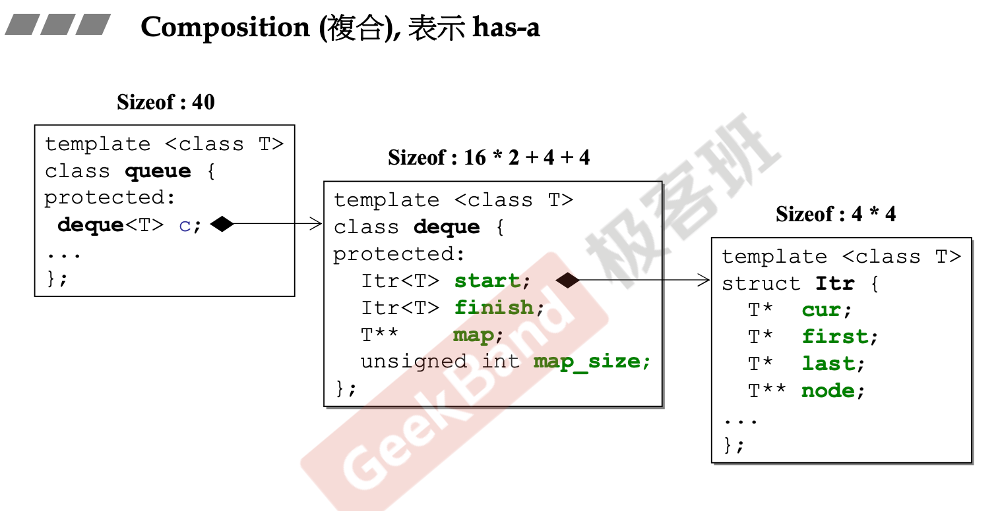

# Composition

## Introduction

```c++
template <typename T> 
class queue {
  ...
protected:
	deque<T> c; // 底層容器
public:
	// 以下完全利用 c 的操作函數完成
	bool empty() const { return c.empty(); } 
    size_type size() const { return c.size(); } 
    reference front() { return c.front(); }
	reference back() { return c.back(); }
	// deque 是兩端可進出，queue 是末端進前端出(先進先出)
    void push(const value_type& x) { c.push_back(x); }
    void pop() { c.pop_front(); }
};
```

Composition(复合)，表示has-a，即class包含某个其他类成员，在class queue中表现为queue的所有功能都依赖于deque完成。

Composition关系使得类具有拓展性，可以不断将功能不同的component类对象复合成到一个container类中，从而实现不同的功能。



### Composition关系下的构造和析构

- 构造由内而外：Container的构造函数中首先要调用Component的构造函数
- 析构由外而内：Container的构造函数中首先要调用自身的析构函数，再调用Component的析构函数

