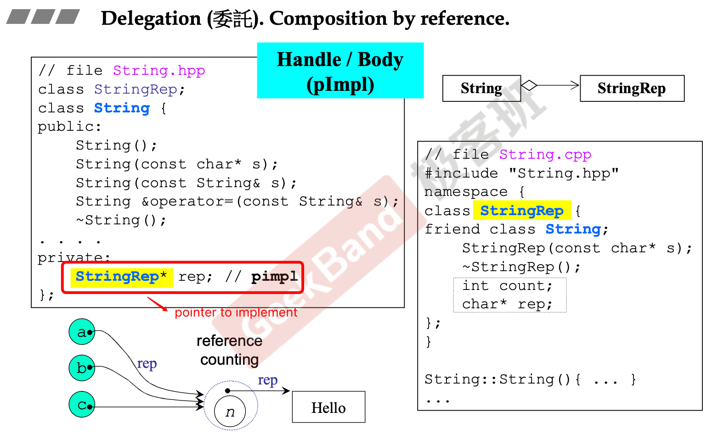

# Delegation

## Introduction

与Composition不同，Composition拥有的是类对象，container类与component对象生存周期相同，而Delegation的handle类拥有的是引用计数（指针）。

Delegation的handle只提供接口，对外不变的情况指针可以指向不同的实现，因此修改实现不会影响客户端。

缺点在于handle不具备拓展性，只注重调用的结果和内部的灵活复用。

