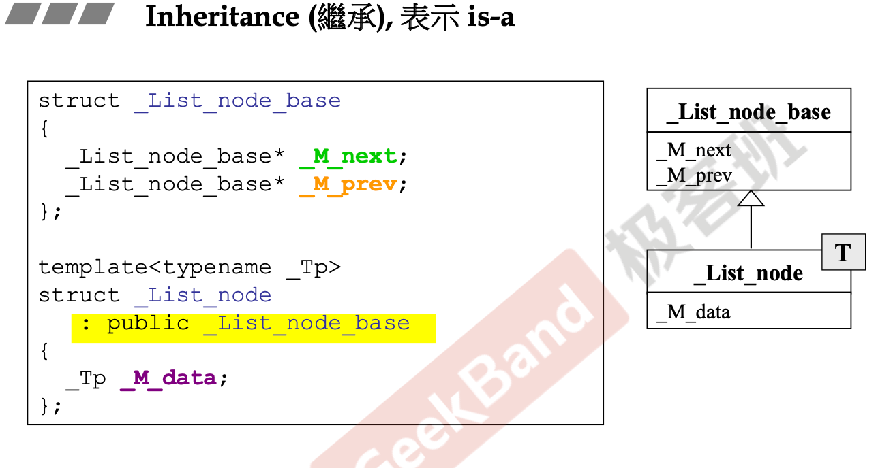

# Inheritance

## Introduction

- 继承关系下基类的析构函数必须是virtual函数，因为基类无法预料子类的行为
- 继承在实际开发中最大的价值是与虚函数结合以及多台

## 虚函数

- non-virtual 函数:你不希望 derived class重新定义 (override，复写) 它。
- virtual 函数:你希望 derived class 重新定義 (override,，复写) 它，且你对它有默认定义。
- pure virtual 函數:你希望 derived class 一定要重新定義 (override，复写) 它，你对它没有默认定义。

## Template Method

大多数时候我们都是基于其他人的框架下进行开发，框架可能定义了一系列模版接口，这些接口可以完成一些common的简单工作，但是框架是无法预料我们的开发行为，因此会某些接口会声明为virtual函数，从而达到延缓实现的效果，函数的实际定义交由开发者完成。

考虑你要在某个文件系统框架下完成读文件的操作：框架可以完成便利文件的行为，但是由于无法提前预知文件类型，所以没法open具体的文件，于是留下了一个`Serialize()`接口，用户可以根据需要实现自己的操作。

因此整个调用流程应该如上图所示，至于对象是如何找到正确的`Serialize()`函数，是因为调用时会将子类对象`myDoc`的this指针作为参数传递，通过这个子类的this指针即可找到子类实现的`Serialize()`函数。

## Inheritance+Composition

- 第一种情况：先调用Base的构造再调用Component的构造函数，析构顺序与构造顺序相反。
- 第二种情况和普通的继承一致：构造由内而外，析构由外而内

## Inheritance+Delegation

- Inheritance+Delegation实际组成了一种设计模式：组合模式。

## Composition和Delegation对比

- Composition表示的类间关系比较强烈，Container类和Component对象的生存周期一致，即由Container来维护Component的生存，如上文图中所讲两者的构造和析构是一体的。
- Delegation表示的类间关系比较松散，指针成员的存在与否不会影响类存在，Delegation类可以需要时才创建委托类的指针对象，保持了一种动态调用的特性，在实际开发中表现为在Delegation类中可以设计init和deinit两个函数用于动态维护指针成员，而保持自身的存在。
  - 此外，以之前实现的String类为例，指针存在一个性能优势，就是在多个对象内容相同的情况下，我只需要维护一份内存的多个引用计数，从而节约开销，在必要时再进行copy-to-write进行减引号和拷贝。
- 两者对于信息的封装程度不一样，在Delegation关系中，委派者和被委派者是相互独立的，客户端了解两者的存在，而在Composition关系中，Component对象对客户端来说是不透明的。