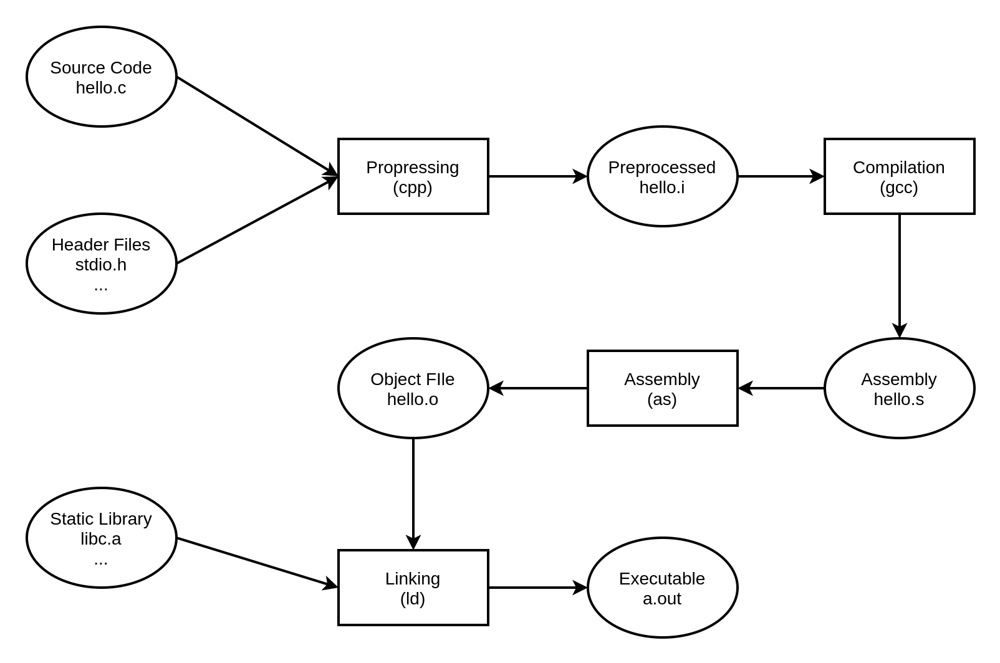

# 从Hello World说起

> 我始终认为对于一个问题比较好的描述方式，是由一个很小很简单的问题或示例入手，层层剥开深入挖掘，不仅探究每个机制“怎么做”，而且要理解它们“为什么这样做”，力求深入浅出、图文并茂，尽力把每一个细节都呈献给读者。

```c
#include <stdio.h>

int main()
{
    printf("Hello World\n");
    return 0;
}
```

我相信Hello World是大部分程序员接触到的第一个程序，在刚接触的编程的时候我们可能使用IDE，只需要将这几行代码复制粘贴，并且按下工具栏中的“构建&运行”按钮，即可在控制台中获得正确的输出。大部分人对于一个程序的理解可能就到此为止，在日常中也只关心编译错误和运行中的遇到的逻辑错误，但这是不够的，哪怕是一个简单的Hello World，也能够引出如下问题：

- 程序为什么要被编译器编译了之后才可以运行？
- 编译器在把C语言转换成可执行的机器码的过程中做了什么，怎么做的？
- 最后编译出来的可执行文件里面是什么？除了机器码还有什么？它们怎么存放的，怎么组织的？
- `#include<stdio.h>`是什么意思？把`stdio.h`包含进来意味着什么？C语言库又是什么？它怎么实现的？
- 不同的编译器（Microsoft VC、GCC）和不同的硬件平台（x86、SPARC、MIPS、ARM），以及不同的操作系统（Windows、Linux、UNIX、Solaris），最终编译出来的结果一样吗？为什么？
- Hello World程序是怎么运行起来的？操作系统是怎么装载它的？它从哪儿开始执行，到哪儿结束？ main函数之前发生了什么？main函数结束以后又发生了什么？
- 如果没有操作系统，Hello World可以运行吗？如果要在一台没有操作系统的机器上运行Hello World需要什么？应该怎么实现？
- printf是怎么实现的？它为什么可以有不定数量的参数？为什么它能够在终端上输出字符串？
- Hello World程序在运行时，它在内存中是什么样子的？

以上的这些问题涉及计算机体系中的种种，假如接受过正统的CS相关专业的教育，这些问题不应该成为难题，但是由于它们分散于不同的知识领域中，因此一般的程序员也很难将其背后的细节阐述明白，本书只关注一个程序从编写到运行的过程，力图还原出一个清晰而流程的脉络。

# 计算机基础

# 编译和链接

对于平常的应用程序开发，我们很少需要关注编译和链接过程，因为通常的开发环境都是流行的集成开发环境（IDE）。这样的IDE一般都将编译和链接的过程一步完成，通常将这种编译和链接合并到一起的过程成为构建（Build）。当然，IDE和编译器提供的默认配置、编译和链接参数对于大部分的应用程序开发而言已经足够使用了，但在这里我们想要探讨软件运行背后的机理及支撑软件运行的各种平台和工具。

```c
// hello.c
#include <stdio.h>

int main()
{
    printf("Hello World\n");
    return 0;
}
```

## What behinds gcc hello.c

在Linux平台下，只需要使用最简单的命令即可完成hello.c的编译和运行：

```shell
gcc hello.c
./a.out
```

但事实上，上述过程可以分解为4个步骤：



### 预编译

预编译过程主要处理那些源代码文件中以“#”开始的预编译指令，并生成`.i`文件：

- 将所有的`#define`删除，并且展开所有的宏定义。
- 处理所有条件预编译指令，比如`#if`、`#ifdef`、`#elif`、`#else`、`#endif`。
- 处理`#include`预编译指令，将被包含的文件插入到该预编译指令的位置。注意，这个过程是递归进行的，也就是说被包含的文件可能还包含其他文件。
- 删除所有的注释`//`和`/* */`。
- 添加行号和文件名标识，比如`#2 “hello.c” 2`，以便于编译时编译期产生调试用的行号信息及用于编译时产生编译错误或警告是能够显示行号。
- 保留所有的`#pragma`编译器指令，因为编译器需要使用它们。

在Linux平台可以使用以下命令进行预编译工作：

```shell
gcc -E hello.c -o hello.i
# or
cpp hello.c > hello.i
```

### 编译

编译过程就是把预处理完的文件进行一系列词法分析、语法分析、语义分析及优化后生产相应的汇编代码文件。编译是构建的核心内容，但并不是本书关注的重点，有关编译的内容建议阅读《编译原理》。

在Linux平台下可以使用以下命令进行编译工作：

```shell
gcc -S hello.i -o hello.s
```

现在版本的GCC把预编译和编译两个步骤合并成一个步骤：

```shell
cc1 hello.c
gcc -S hello.c -o hello.s
# cc1plus hello.cpp
```

上述命令都可以得到汇编输出文件hello.s，对于C语言的代码来说，这个预编译和编译的程序是cc1，对于C++来说是cc1plus，Objective-C是cc1obj，fortran是f771，Java是jc1。所以实际上gcc这个命令只是这些后台程序的包装，它会根据不同的参数要求去调用预编译编译程序cc1,、汇编器as、链接器ld。

### 汇编

 汇编器是将汇编代码转变成机器可以执行的指令，每一个汇编语句几乎都对应一条机器指令。所以汇编器的汇编过程相对于编译器来说比较简单，它没有复杂的语法，也没有由于，也不需要做指令优化，只是根据汇编指令和机器指令的对照表一一翻译就可以了。上面的汇编过程可以用汇编器as来完成：

```shell
as hello.s -o hello.o
# or
gcc -c hello.s -o hello.o
gcc -c hello.c -o hello.o
```

### 链接

```shell
ld -static crt1.o crti.o crtbeginT.o hello.o -start-group -lgcc -lgcc_eh -lc -end-group crtend.o crtn.o
```

所谓链接就是把各个模块之间相互引用的部分都处理好，使得各个模块之间能够正确的衔接。虽然Hello World是一个很简单的程序，但是它内部包含的printf底层的Write系统调用被封装在其他的目标文件中，因此需要除了hello.o以外还需要引入一系列其他的目标文件才能让程序正常运行起来。

## 模块拼装——静态链接

链接的过程主要包括了地址和空间分配（Address and Storage Allocation）、符号决议（Symbol Resolution）和重定位（Relocation）等步骤。

现代的编译和链接过程并非想象中的那么复杂，只是要求具备模块化的思想。假设我们有个全局变量var在目标文件a.o中，我们在目标文件b.o中要访问这个全局变量并对其赋值`var = 42;`，那么目标文件b.o中将会存在这样一条汇编指令：

```assembly
movl $0x2a, var
# machine command: C705 00000000 2a000000
#                  movl dst_addr src_val
```

可以看到机器指令中的目标地址为0x00，这是因为在编译目标文件B的时候，编译器并不知道变量var的目标地址，默认设为0x00，等待链接器在将目标文件A和B链接起来的时候再将其修正。

```c
// a.c
int var = 0;

// b.c
#include <stdio.h>

extern int var;

int main()
{
    var = 42;

    return 0;
}
```

使用gcc将这两个源文件编译成目标文件：

```shell
gcc -c a.c -o a.o
gcc -c b.c -o b.o
```

使用objdump进行反汇编：

```shell
ts@ts-OptiPlex-7070:~/Downloads/test$ objdump -d a.o

a.o:     file format elf64-x86-64

ts@ts-OptiPlex-7070:~/Downloads/test$ objdump -d b.o

b.o:     file format elf64-x86-64


Disassembly of section .text:

0000000000000000 <main>:
   0:	55                   	push   %rbp
   1:	48 89 e5             	mov    %rsp,%rbp
   4:	c7 05 00 00 00 00 2a 	movl   $0x2a,0x0(%rip)        # e <main+0xe>
   b:	00 00 00 
   e:	b8 00 00 00 00       	mov    $0x0,%eax
  13:	5d                   	pop    %rbp
  14:	c3                   	retq   
```

由于a.c只有一个全局变量`var`，而经过初始化的全局变量会保存在目标文件的.bss段中，因此objdump对于目标文件a.o的反汇编结果为空。可以看到b.o的反汇编结果正如上文中阐述的一样，b.o中的第3条指令显示这是`var`的地址为0x00。

使用ld将两个目标文件链接成可执行文件ab后再观察反汇编结果：

```shell
ld a.o b.o -e main -o ab

ts@ts-OptiPlex-7070:~/Downloads/test$ objdump -d ab

ab:     file format elf64-x86-64


Disassembly of section .text:

00000000004000e8 <main>:
  4000e8:	55                   	push   %rbp
  4000e9:	48 89 e5             	mov    %rsp,%rbp
  4000ec:	c7 05 42 00 20 00 2a 	movl   $0x2a,0x200042(%rip)        # 600138 <__bss_start>
  4000f3:	00 00 00 
  4000f6:	b8 00 00 00 00       	mov    $0x0,%eax
  4000fb:	5d                   	pop    %rbp
  4000fc:	c3                   	retq   
```

可以看到可执行文件ab中所有未知值都被赋予了一个真实值，main函数的地址被固定下来，`var`的地址被赋值为0x00200042。

这个地址修正的过程被叫做重定位，每个要被修正的地方叫重定位入口。我们可以通过objdump来查看目标文件的重定位表来获取重定位相关的信息：

```shell
ts@ts-OptiPlex-7070:~/Downloads/test$ objdump -r b.o

b.o:     file format elf64-x86-64

RELOCATION RECORDS FOR [.text]:
OFFSET           TYPE              VALUE 
0000000000000006 R_X86_64_PC32     var-0x0000000000000008


RELOCATION RECORDS FOR [.eh_frame]:
OFFSET           TYPE              VALUE 
0000000000000020 R_X86_64_PC32     .text
```

让我们关注[.text]代码段的重定位信息，可以看到b.o的.text段存在一个重定位入口，offset为0x06，查看反汇编代码可以知道恰好是var变量在目标文件b.o中地址，于是链接器知道var这个变量需要进行重定位。这部分的细节将在后续文章中进行展开。