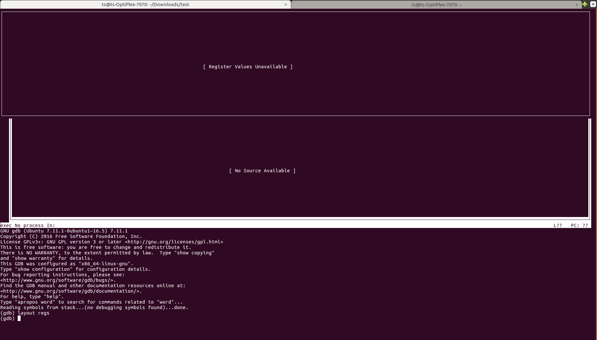
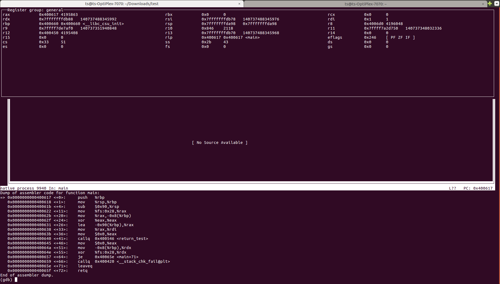
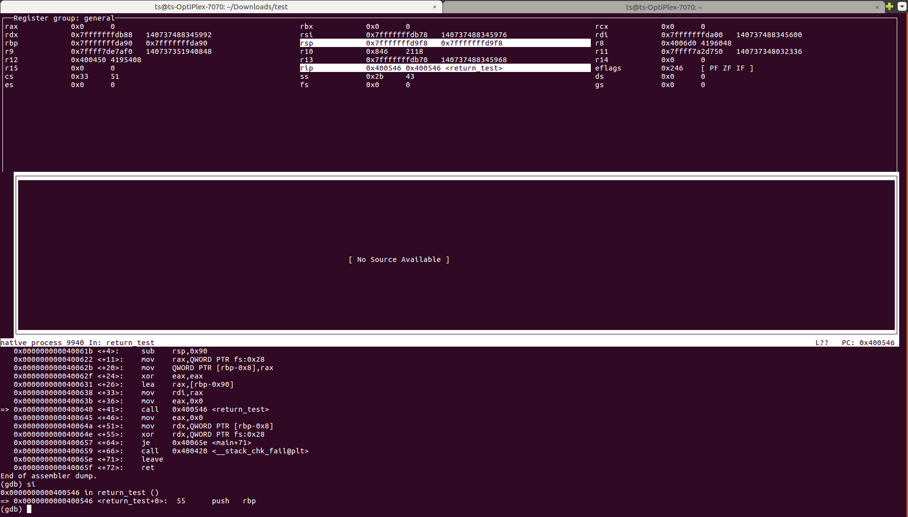

# 函数返回值传递

## Overview

本文记录了我在阅读《程序员自我修养——链接、装载与库》书中Chapter 10.02.3一节时实践过程，这一节研究了当函数调用返回值大于8个字节（32位机器，64位机器则是16个字节）时的内存栈情况，实验代码如下：

```c
// stack.c
typedef struct big_thing {
    char buf[128];
}big_thing;

big_thing return_test()
{
    big_thing b;
    b.buf[0] = 0;
    return b;
}

int main()
{
    big_thing n = return_test();
}
```

实验结果与书中说法有些许出入，这或许是因为书籍出版时间过早，经过十几年的发展，某些规范经过了修改，但无伤大雅 ，思想上并没有太大变化。实验环境如下：

- Architecture：x86_64
- OS：inux version 4.15.0-142-generic（Ubuntu 16.04）
- Compiler：gcc version 5.4.0
- Debugger：GNU gdb (Ubuntu 7.11.1-0ubuntu1~16.5) 7.11.1

## 反汇编

我们可以知道eax寄存器（寄存器命名在不同平台可能不同，在我的Ubuntu环境下为rax）是传递函数返回值的通道，返回后函数的调用方可以通过读取eax寄存器的值获得函数的返回值，但是eax只有4（或8）个字节，在返回8（或16）字节的值是会使用eax和ebx两个寄存器协同完成返回值的传递，eax返回低字节部分，ebx返回高字节部分。

当返回值类型更大时，例如测试代码中的`return_test()`返回的`big_thing`是一个长度为128字节的结构，这是返回值的传递变得更加特殊，首先我们反汇编这段代码。

**注：**objdump在我的机器上只支持反汇编成AT&T格式的汇编指令，不利于阅读，下面汇编码源自gdb，使用intel格式，主要关注`return_test()`和`main()`。

```assembly
# gcc stack.c -o stack
# gdb stack
# set disassembly-flavor intel

# (gdb) disassemble return_test
# Dump of assembler code for function return_test:
   0x0000000000400546 <+0>:	push   rbp
   0x0000000000400547 <+1>:	mov    rbp,rsp
   0x000000000040054a <+4>:	sub    rsp,0xa0
   0x0000000000400551 <+11>:	mov    QWORD PTR [rbp-0x98],rdi
   0x0000000000400558 <+18>:	mov    rax,QWORD PTR fs:0x28
   0x0000000000400561 <+27>:	mov    QWORD PTR [rbp-0x8],rax
   0x0000000000400565 <+31>:	xor    eax,eax
   0x0000000000400567 <+33>:	mov    BYTE PTR [rbp-0x90],0x0
   0x000000000040056e <+40>:	mov    rax,QWORD PTR [rbp-0x98]
   0x0000000000400575 <+47>:	mov    rdx,QWORD PTR [rbp-0x90]
   0x000000000040057c <+54>:	mov    QWORD PTR [rax],rdx
   0x000000000040057f <+57>:	mov    rdx,QWORD PTR [rbp-0x88]
   0x0000000000400586 <+64>:	mov    QWORD PTR [rax+0x8],rdx
   0x000000000040058a <+68>:	mov    rdx,QWORD PTR [rbp-0x80]
   0x000000000040058e <+72>:	mov    QWORD PTR [rax+0x10],rdx
   0x0000000000400592 <+76>:	mov    rdx,QWORD PTR [rbp-0x78]
   0x0000000000400596 <+80>:	mov    QWORD PTR [rax+0x18],rdx
   0x000000000040059a <+84>:	mov    rdx,QWORD PTR [rbp-0x70]
   0x000000000040059e <+88>:	mov    QWORD PTR [rax+0x20],rdx
   0x00000000004005a2 <+92>:	mov    rdx,QWORD PTR [rbp-0x68]
   0x00000000004005a6 <+96>:	mov    QWORD PTR [rax+0x28],rdx
   0x00000000004005aa <+100>:	mov    rdx,QWORD PTR [rbp-0x60]
   0x00000000004005ae <+104>:	mov    QWORD PTR [rax+0x30],rdx
   0x00000000004005b2 <+108>:	mov    rdx,QWORD PTR [rbp-0x58]
   0x00000000004005b6 <+112>:	mov    QWORD PTR [rax+0x38],rdx
   0x00000000004005ba <+116>:	mov    rdx,QWORD PTR [rbp-0x50]
   0x00000000004005be <+120>:	mov    QWORD PTR [rax+0x40],rdx
   0x00000000004005c2 <+124>:	mov    rdx,QWORD PTR [rbp-0x48]
   0x00000000004005c6 <+128>:	mov    QWORD PTR [rax+0x48],rdx
   0x00000000004005ca <+132>:	mov    rdx,QWORD PTR [rbp-0x40]
   0x00000000004005ce <+136>:	mov    QWORD PTR [rax+0x50],rdx
   0x00000000004005d2 <+140>:	mov    rdx,QWORD PTR [rbp-0x38]
   0x00000000004005d6 <+144>:	mov    QWORD PTR [rax+0x58],rdx
   0x00000000004005da <+148>:	mov    rdx,QWORD PTR [rbp-0x30]
   0x00000000004005de <+152>:	mov    QWORD PTR [rax+0x60],rdx
   0x00000000004005e2 <+156>:	mov    rdx,QWORD PTR [rbp-0x28]
   0x00000000004005e6 <+160>:	mov    QWORD PTR [rax+0x68],rdx
   0x00000000004005ea <+164>:	mov    rdx,QWORD PTR [rbp-0x20]
   0x00000000004005ee <+168>:	mov    QWORD PTR [rax+0x70],rdx
   0x00000000004005f2 <+172>:	mov    rdx,QWORD PTR [rbp-0x18]
   0x00000000004005f6 <+176>:	mov    QWORD PTR [rax+0x78],rdx
   0x00000000004005fa <+180>:	mov    rax,QWORD PTR [rbp-0x98]
   0x0000000000400601 <+187>:	mov    rcx,QWORD PTR [rbp-0x8]
   0x0000000000400605 <+191>:	xor    rcx,QWORD PTR fs:0x28
   0x000000000040060e <+200>:	je     0x400615 <return_test+207>
   0x0000000000400610 <+202>:	call   0x400420 <__stack_chk_fail@plt>
   0x0000000000400615 <+207>:	leave  
   0x0000000000400616 <+208>:	ret 
# (gdb) disassemble main
# Dump of assembler code for function main:
   0x0000000000400617 <+0>:	push   rbp
   0x0000000000400618 <+1>:	mov    rbp,rsp
   0x000000000040061b <+4>:	sub    rsp,0x90
   0x0000000000400622 <+11>:	mov    rax,QWORD PTR fs:0x28
   0x000000000040062b <+20>:	mov    QWORD PTR [rbp-0x8],rax
   0x000000000040062f <+24>:	xor    eax,eax
   0x0000000000400631 <+26>:	lea    rax,[rbp-0x90]
   0x0000000000400638 <+33>:	mov    rdi,rax
   0x000000000040063b <+36>:	mov    eax,0x0
   0x0000000000400640 <+41>:	call   0x400546 <return_test>
   0x0000000000400645 <+46>:	mov    eax,0x0
   0x000000000040064a <+51>:	mov    rdx,QWORD PTR [rbp-0x8]
   0x000000000040064e <+55>:	xor    rdx,QWORD PTR fs:0x28
   0x0000000000400657 <+64>:	je     0x40065e <main+71>
   0x0000000000400659 <+66>:	call   0x400420 <__stack_chk_fail@plt>
   0x000000000040065e <+71>:	leave  
   0x000000000040065f <+72>:	ret 
```

## gdb tricks

要还原整个函数的调用过程，就需要弄明白每一步汇编指令执行时各个寄存器中值的变化，这对于没有汇编基础的人来说或许会有些苦难，gdb提供了一系列汇编调试的命令可以检测整个程序过程中寄存器值的变化。

```shell
gdb -tui stack
(gdb) layout regs
```

使用上述两条指令可以打开寄存器监视窗口。



```shell
(gdb) b *main	# 在函数的第一条汇编指令设置断点
(gdb) set disassemble-next-line on		# 自动反汇编后面要执行的代码
(gdb) r
```

通常gdb给函数设置断点的命令是`b func`，但这不会把断点设置在汇编指令层次函数的开头，需要使用`b *func`把断点设置在汇编指令层次函数的开头，然后就可以开始按行调试。

## main()



目前程序停在main函数的第一条汇编指令，可以看到`rbp: 0x400660`，`rsp: 0x7fffffffda98`和`rip: 0x400617`三个寄存器的地址，其中rbp指向`__libc_csu_init()`这个初始化函数，而rip指向main的第一条汇编指令。接下来使用`si`命令逐步调试汇编指令。

- `push rbp`：将当前rbp的值保存到栈中，等到函数结束时再还原。由于是保存到栈中，因此栈的大小将增大8个字节，故rsp的值为`0x7fffffffda90`。
- `mov rbp, rsp`：rbp指向此时的栈顶，作为基址，意味着一个函数要被调用，可以用于这个被调用函数内的数据和寄存器的寻址，这里即将被调用的是main函数。
- `sub rsp,0x90`：扩大栈144个字节，用于保存寄存器值和main函数的局部变量和保留区域。
- `mov rax,QWORD PTR fs:0x28`：给rax寄存器赋值，这个值是一个内核地址`0xbe7508b1fa433f00`，具体含义不明。
- `mov QWORD PTR [rbp-0x8],rax`：保存rax的值。
- `xor eax,eax`：将rax寄存器值置零。
- `lea rax,[rbp-0x90]`：`rax=0x7fffffffda00`，即当前栈顶。
- `mov rdi,rax`：rdi寄存器指向当前栈顶。
- `mov eax,0x0`：将rax寄存器值置零。
- `call 0x400546 <return_test>`：调用`return_test()`

## return_test()



进入return_test()之后，可以看到rsp减小了8字节，这是因为call命令会将函数的下一条命令，即`0x0000000000400645 <+46>: mov eax,0x0`的地址作为函数的返回地址压入栈中，我们可以使用`x/8xb 0x7fffffffd9f8`打印这8个字节的值，确实为`0x400645`。

`return_test()`的开头和`main()`一样，同样是保存用于回复函数调用现场的一些寄存器值，此时`rbp:0x7fffffffd9f0`，`rsp: 0x7fffffffd950`。

重点看一连串的mov命令：

- `mov BYTE PTR [rbp-0x90],0x0`：将rbp-0x90这个字节的值置为0，即`b.buf[0] = 0;`。
- `mov rax,QWORD PTR [rbp-0x98]`：将rdi寄存器的值，即`0x7fffffffda00`置入rax寄存器，这个地址是`main()`函数申请的用于存储临时变量n的地址。
- `mov rdx,QWORD PTR [rbp-0x90]`：将变量b的起始地址`0x7fffffffd960`的值置入rdx寄存器；
- `mov QWORD PTR [rax],rdx`：将rdx寄存器中的值置入rax寄存器中，也即完成8个字节数据的拷贝，总计执行16组8字节拷贝，即拷贝了128个字节，即将变量b的128个字节全部拷贝回`main()`中的`n`。
- `mov rax,QWORD PTR [rbp-0x98]`：还原rax的值为变量`n`的地址。

后续是一些函数退出的资源回收的命令，这里不做深究，可以看到这里与书中的描述不太一致，按照书中的描述在MSVC9中总计发生了两次拷贝：

- `memcpy(ebp-88h, eax, 0x20*4);`：其中`ebp-88h`是变量`n`的地址，eax是`return_test()`函数调用返回值，存储的是结构体的指针，是一个临时空间`temp`的地址`ebp-1d0h`。
- `memcpy([ebp+8], &b, 128);`：将变量b的值向`ebp+8`的指向的地址拷贝128字节，其中`ebp+8`是临时空间`temp`的地址，通过retunrn_test()调用隐式传入。
- `return_test(void* addr)`：这个addr是临时空间temp的地址。

书中没有用gcc做例子所以我也不清楚gcc上的情况，但是从书中303页展示的反汇编码来看，同样也是发生了两次拷贝，而我的实验结果显示现在的程序中并不存在这个temp空间，程序是直接从`return_test()`的栈向`main()`栈上直接做拷贝。

## Post script

实验程序从main函数开始分析，但事实上一个程序并不是从main函数开始执行，在main函数之前还有一系列的init工作（这些内容会在之后分析），因此本文展示的调用栈是不完整的。

参考资料：

- 《程序员自我修养——链接、装载与库》
- [100个gdb小技巧](https://wizardforcel.gitbooks.io/100-gdb-tips/content/index.html)