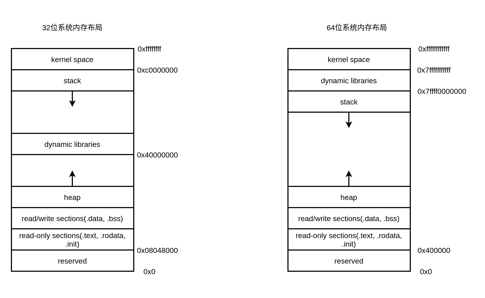
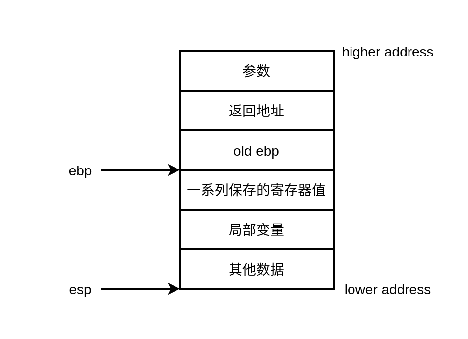
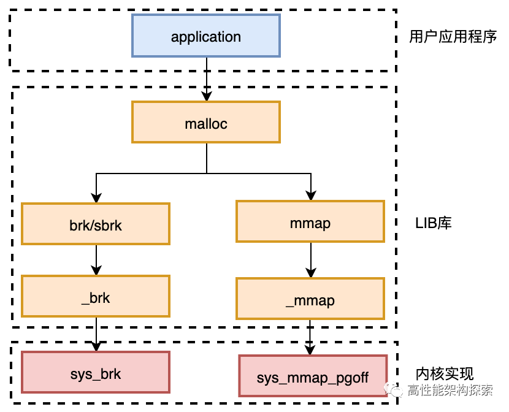

# 内存

## 程序(进程)的内存布局

一般来讲，应用程序使用的内存空间有如下”默认“的区域：

- 栈：栈用于维护函数调用的上下文，局部变量和函数参数往往保存在其中，32为系统栈的大小最多为4MB，64为系统栈的大小最多为8MB，由高地址向低地址方向拓展。
- 堆：堆是用来容纳应用程序动态分配内存的区域，堆空间的申请与释放由程序员通过malloc/free和new/delete函数手动管理，由低地址向高地址方向拓展。
- 可执行文件映像：存储可执行文件在内存里的映像，由装载器在装载时将可执行文件的内存读取或映射到这里，根据读写属性进行基础的划分，主要包括代码段和数据段。
- 保留区：保留区并不是一个单一的内存区域，而是对内存中收到保护而禁止访问的内存区域的总称，例如中断向量表就存储在其中。



上图展示了32位系统和64位系统进程的程序布局。其中32位系统的寻址空间为4GB，最顶部1GB为kernel space，用户禁止访问，剩余空间为用户空间。64位系统理论寻址空间为`2^64`次方，但考虑到现实需求，目前仅使用了`2^48`寻址空间，其中kernel space占据顶部128TB，剩余128TB为用户空间。

## 栈与调用惯例

### 栈

在计算机系统中，栈是一个具有FIFO属性的动态内存区域，程序可以将数据压入栈中，也可以将数据从栈顶弹出。如前文所述，栈总是向下增长，栈顶则由esp（stack pointer）寄存器进行定位：压栈使得栈增大，即esp减小；出栈使得栈减小，即esp增大。**同样，直接减小esp的值也等效于在栈上开辟空间，直接增大esp的值等效于在栈上回收空间，即栈的大小变化在汇编层面上被反映为对esp寄存器值的修改(sub，add，mov，lea等命令)。**

栈保存了一个函数所需要的维护信息，通常被称作堆栈帧，在gdb中可以使用`i frame`查看当前调用函数堆栈的信息。堆栈帧一般包括如下几方面的信息：

- 函数的返回地址和参数。
- 临时变量：包括函数的非静态局部变量以及编译期自动生成的其他临时变量。
- 保存的上下文：包括在函数调用前后需要保持不变的寄存器。

通常，一个函数的活动记录用ebp（base pointere）和esp两个寄存器划定范围：esp始终指向栈的顶部，同时也就指向了当前函数的活动记录的顶部；ebp指向一个固定位置，一般是函数调用发生时esp的值，用于辅助函数内部数据寻址。一个典型的函数调用栈如下图所示：



之所以会形成这样的结构是由函数调用规则决定的：

- 把所有或一部分参数压入栈中，如果有其他参数没有入栈，那么使用某些特定的寄存器传递。
- 把当前指令的下一条指令的地址（返回地址）压入栈中。
- 跳转到函数体执行。

### 调用惯例

函数能够成功调用并返回的前提是函数的调用方和被调用方对函数如何调用有着统一的理解，这个统一的理解即是**调用惯例**，调用惯例通常包含以下内容：

- 函数参数的传递顺序和方式
- 栈的维护方式
- 名字修饰（name-mangling）策略

默认的调用惯例为`cdecl`：规定出栈放为函数调用方，参数以从右至左的顺序压入栈，名称修饰为下划线加函数名。还有其他的调用惯例，这里不做过多阐述。

## 堆

堆是一块巨大的内存空间，常常占据整个虚拟空间的绝大部分，在这片空间里，程序可以请求一块连续内存，并自由地使用，这块内存在程序主动放弃之前都会一直保持有效。

Linux操作系统提供了两个系统调用用于堆空间分配：

- `int brk(void* end_data_segment);`
- `void *mmap(void *addr, size_t length, int prot, int flags, int fd, off_t offset); `

但假如每次申请或者释放堆空间都直接使用系统调用，那么当频繁对堆空间进行操作时，会严重影响程序的性能。为了提高程序运行效率，提出了”内存管理“这一概念：它是软件运行时对计算机内存资源的分配和使用的技术，其最主要的目的是如何高效，快速的分配，并且在适当的时候释放和回收内存资源。内存管理功能通常由内存管理器提供，具体形式上是一个程序**运行库**。

运行库相当于向操作系统”批发“了一块较大的堆空间，然后”零售”给程序用，具体的操作和调度由分配算法来实现，不同的内存管理库的堆空间分配算法有所不同。

### Linux进程堆管理

根据上文分析可以得到Linux系统堆管理的调用流程如下图所示：



### brk()

```c
int brk(void* end_data_segment);
void *sbrk(intptr_t increment);
```

brk()的作用实际上就是设置进程数据段的结束地址，即它可以扩大或者缩小数据段。在Glibc中还提供了一个sbrk()，它是对brk()的封装，sbrk()以一个增量作为参数，increment为正数，则扩大数据段，increment为负数则缩小数据段，返回值是变化后的数据段地址，假如increment为0，则返回当前数据段地址。

### mmap()

```c
void *mmap(void *addr, size_t length, int prot, int flags, int fd, off_t offset); 
int munmap(void *addr, size_t length);
```

mmap()用来在进程虚拟内存地址空间中分配地址空间，创建和物理内存的映射关系。当这块虚拟地址空间不映射到某个文件时，即使用匿名映射时，这块匿名空间可以用作堆空间。

- addr：指定需要申请空间的起始地址
- length：指定申请空间的长度
- prot：设置申请空间的权限，`PROT_READ | PROT_WRITE | PROT_EXEC | PROT_NONE`
- flags：设置申请空间的映射类型，`MAP_SHARED | MAP_PRIVATE | MAP_ANONYMOUS `
- fd：文件映射时指定文件描述符
- offset：文件映射时指定文件偏移

**注：**mmap申请的空间根据映射类型和映射关系共有四种排列组合，具体不展开。

mmap只是在虚拟内存分配了地址空间，只有在第一次访问虚拟内存的时候才分配物理内存。

在mmap之后，并没有在将文件内容加载到物理页上，只有在虚拟内存中分配了地址空间。当进程在访问这段地址时，通过查找页表，发现虚拟内存对应的页没有在物理内存中缓存，则产生"缺页"，由内核的缺页异常处理程序处理，将文件对应内容，**以页为单位(通常是4096)加载到物理内存（即mmap申请的空间起始地址和大小都必须是系统页大小的整数倍）**，注意是只加载缺页，但也会受操作系统一些调度策略影响，加载的比所需的多。

### 堆分配算法

堆空间只是程序向操作系统申请画出来的一大块地址空间，从上一节的流程图可以看出C语言提供的malloc/free函数由Glibc提供最终实际还是使用了系统调用，但是为了提高内存分配的效率malloc/free的底层使用了复杂的分配算法。书中只介绍了最简单的两种。

#### 空闲链表

空闲链表的方法实际上就是把堆中各个空闲的块按照链表的方式连接起来，当用户请求一块空间时，可以遍历整个列表，直到找到合适大小的块并且将它拆分；当用户释放空间时将它合并到空闲链表中。


首先在空闲链表里查找足够容纳请求大小的空闲块，然后将这个块拆分为两部分，一部分为程序请求的空间，另一部分为剩余下的空闲空间，然后更新链表。

**注：**书里说这样的空闲链表在释放空间的时候，给带你过一个已分配块的指针，堆无法确定这个块的大小，所以通常会多分配4个字节用于存储内存大小。这个问题我曾经使用lldb打印变量的内存分配情况具体查看过，使用malloc分配的变量的虚拟内存空间里并没有看到这个多余的4个字节，猜想这部分已经完全交由内存管理器管理。

#### 位图

位图将整个堆空间在逻辑上划分为大量的块，每个块的大小相同，当用户请求内存时总是分配整数个块的空间给用户，第一个块称为已分配区域的头，其余的称为已分配区域的主体，由于每个块只有头/主体/空闲三种状态，因此可以使用2位来表示一个块。

#### 内存池（对象池）

对象池的思想很简单，如果每一次分配的空间大小都一样那么就可以按照每次请求分配的大小作为一个单位，把整个堆空间划分为大量的小块，每次请求的时候只需要找到一个小块就可以了。


实际上的内存管理器往往是采用多种分配算法协同工作，但从我的理解glibc的内存管理器ptmalloc使用的是基于空闲链表的内存池，具体可以阅读[2万字|30张图带你领略glibc内存管理精髓](https://mp.weixin.qq.com/s/pdv5MMUQ9ACpeCpyGnxb1Q)。